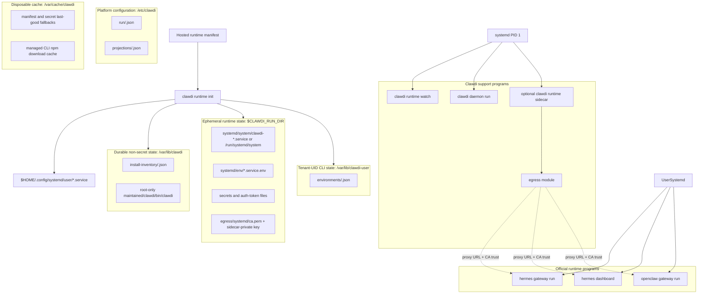
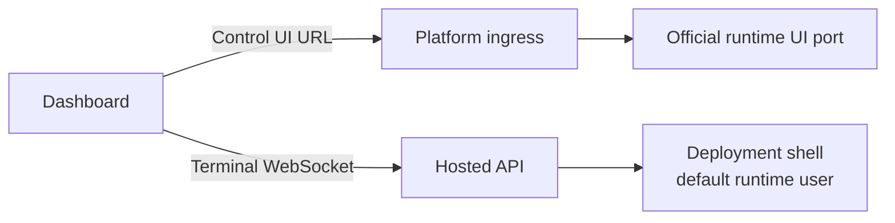

# Managed Runtime Contract

| Field | Value |
| --- | --- |
| Status | Public runtime contract |
| Last updated | 2026-08-24 |
| Owner | CLI runtime and cloud-api layers |

This document describes the public Clawdi CLI and dashboard contract for managed
runtime environments. It intentionally avoids deployment-specific topology,
private service details, live service hosts, and internal runtime orchestration.

Related public docs:

- CLI notes: [`plans/managed-runtime-cli.md`](plans/managed-runtime-cli.md)
- Roadmap: [`plans/managed-runtime-roadmap.md`](plans/managed-runtime-roadmap.md)
- Projection boundary:
  [`plans/runtime-projection-boundary.md`](plans/runtime-projection-boundary.md)

## Scope

The open-source CLI owns local runtime convergence, explicit `clawdi run`
env-injection, generic/self-hosted runtime UI bridging, and diagnostics. It does not own
OpenClaw/Hermes binaries, native update flows, or runtime process behavior.
The web app owns the hosted deployment dashboard surfaces, including Control UI
and Terminal tabs. First-party hosted control planes may provide desired state,
credentials, terminal authorization, rollout policy, and deployment lifecycle,
but those platform-specific implementations are outside this repository.

The public contract covers:

- validating runtime desired state;
- installing or verifying supported agent runtimes through their normal
  installers;
- writing non-secret local run configuration;
- projecting runtime secrets only onto their declared runtime surfaces,
  including the OpenClaw gateway's official config and transient installer
  environment;
- running final hosted runtimes from direct process-manager entries that name
  official Hermes/OpenClaw binaries;
- running Clawdi-owned support programs under the runtime process manager;
- supporting explicit `clawdi run -- <command>` when a caller opts into Clawdi
  runtime env injection;
- exposing strict-v2 OpenClaw directly on its native `18789` gateway with
  official shared-token authentication and no device-pairing step when the
  typed authorization capability is active;
- exposing a dashboard Terminal contract for one deployment shell;
- reporting status and diagnostics through runtime commands.

The public contract does not cover:

- deployment-specific topology;
- private control-plane endpoints;
- tenant or billing policy;
- internal service implementation;
- image build pipelines or platform rollout details.

## Cloud API Runtime Observation Companion

The declarative v2 runtime adds an observation companion without changing the
existing v1 daemon heartbeat or observation writer. A deployment-bound runtime
API key sends credential-authenticated evidence to the direct `/v2` runtime
router; cloud-api appends evidence and never writes a Hosted deployment status.

Cloud-api reuses these existing runtime primitives:

- `AgentEnvironment.id` as the stable environment identity;
- managed, environment-bound `ApiKey` authentication with an immutable
  `runtime_deployment_id` identity binding;
- the first-party `X-Admin-Key` gate, mutation idempotency, and control-plane
  audit events for Hosted-facing provisioning and retirement calls;
- PostgreSQL transactions and `FOR UPDATE` locks for ingestion, retirement,
  desired-state cleanup, and late-write serialization.

`POST /v1/agents/{agent_id}/sync-heartbeat` remains the frozen v1 liveness and
latest-observation transport. It neither accepts strict-v2 identity fields nor
reads or writes companion tables. Strict-v2 ingestion is
`POST /v2/runtime/environments/{environment_id}/observations`; it writes only
the companion inbox, fence high-water, and boot-session head.

Four PostgreSQL tables form the additive companion boundary:

| Table | Contract |
| --- | --- |
| `v2_runtime_environment_fences` | Permanent environment/owner/deployment binding, active or retired state, replay floor, immutable final retirement receipt/high-waters, and the durable runtime-state cleanup receipt. |
| `v2_runtime_observation_inbox` | Immutable change evidence with the five-field boot identity, boot-scoped sequence, global event id, timestamps, payload hash, and health. Private diagnostic payloads may be compacted in place after retention eligibility; a fresh active head keeps its current projection readable, while compaction of a stale head forces the next heartbeat to restore change evidence. |
| `v2_runtime_observation_heads` | One immutable boot-session binding with non-regressing accepted sequence, change-event stream position, last-seen capture time, and freshness. Semantically unchanged heartbeats refresh this row without appending inbox evidence; retirement compacts it to a tombstone. |
| `v2_runtime_observation_consumer_cursors` | Environment-and-consumer ACK state, replay horizon, and explicit fail-closed expiry/reset boundary used by safe prefix retention. |

Strict-v2 credential provisioning is only available through
admin-authenticated `POST /v2/runtime/auth/keys`. The admin and platform v1 key
APIs keep their original wire shape and cannot create a fence or
deployment-bound credential. The provisioning endpoint represents one
canonical Hosted Runtime role, so its request does not negotiate scopes. The
Cloud issuer assigns the auditable bundle `connectors:read`,
`connectors:invoke`, `runtime-observations:write`, `sessions:read`,
`sessions:write`, `skills:read`, and `skills:write`. Principal identity comes
only from the managed environment/deployment binding; each data-plane operation
separately requires its scope. The database constrains only the identity
binding, while the issuer and migration own the canonical authorization bundle.

Hosted-facing `/v2` registration, read, acknowledgement, reset, retirement, and
provisioning calls require the first-party `X-Admin-Key`. Retired runtime-state
cleanup also accepts a platform workload token with the existing
`platform:runtime-environments:retire` scope. The server binds
observation cursors to its fixed Hosted controller identity, and immutable
owner/deployment authority is resolved from the environment fence rather than
caller-selected request data, so opaque cursors cannot cross consumers or
environments. Platform workload OAuth remains separate, default-closed
infrastructure for the future resale platform surface; it is not on this v2
data-plane path.

Ingestion locks the permanent environment fence and rejects a retired binding
before it inspects or creates a boot-session head. Retirement uses the same
fence lock, freezes all session high-waters, persists the final cursor and
receipt, writes one durable control-plane transition audit, and tombstones all
heads atomically. Replaying the same retirement ID returns the persisted
receipt; a different ID or deployment binding conflicts. V1 agent deletion and
key revocation retain their pre-companion behavior and do not consult the v2
fence. Trusted Hosted controller ordering obtains the retirement receipt before
requesting `POST /v2/runtime/environments/{environment_id}/runtime-state/cleanup`
with the exact environment, deployment, retirement, and stable cleanup
identities. Cleanup derives owner authority from the permanent fence, removes
only matching desired state, releases its OAuth claims, and stores an immutable
versioned absence receipt. Exact retries return that receipt; identity reuse or
mismatch conflicts. Runtime-state writers lock `User`, then the fence, then
subordinate state and OAuth rows. A retired fence rejects new writes, including
legacy admin v2 writers, while old successful platform idempotency replays do
not execute a write. The permanent fence itself is never deleted.

Retention advances the replay floor only across a contiguous per-environment
stream prefix. Every row in a normal replay-horizon prefix must be old enough
and acknowledged by every required active consumer. Hard retention may expire
lagging consumers explicitly, but it still stops at the first younger stream
position, preventing a preserved lower id from being silently skipped. Eligible
rows are compacted in place: private diagnostics are scrubbed and
`payload_purged_at` records the one-way transition, while event ID,
environment/session/sequence identity, payload hash, timestamps, and uniqueness
constraints remain. Replay-floor maintenance may advance monotonically after
retirement without changing the immutable receipt or final high-water fields.
When the hard cap expires or advances a consumer boundary, retention writes a
redacted system audit in the same transaction as the cursor and compaction.
Active heads must reference their exact inbox stream position, and a retired
fence's final position must equal its frozen stream high-water at the database
boundary.

## Core Architecture

The primary hosted runtime model is a Linux-like runtime host. The host image
provides the OS envelope, a runtime user, a root-only `clawdi` bootstrap path,
the prerequisites for official Hermes/OpenClaw installers, and a process
manager. Runtime behavior comes from the manifest and official runtime
binaries, not from per-agent wrappers. The managed Clawdi CLI is an
administrator capability: the runtime user, model tools, and browser terminal
cannot resolve, read, or execute it.



The process manager is systemd. The important contract is that each
long-running program is declared directly with its official command, args, cwd,
and env. Clawdi support processes use `clawdi-*` service names; OpenClaw and
Hermes gateway base units use runtime-owned service names generated by official
service installers, such as `openclaw-gateway.service` and
`hermes-gateway.service`. Runtime services must not point at `clawdi run --
openclaw`, `clawdi run -- hermes`, a generated launch shell, or a PATH shim. If
Clawdi must temporarily run an auxiliary process that has no official service
installer, the unit uses a `clawdi-*` name and is documented as compatibility,
not as a runtime-owned service.

The Linux-like host preserves official updater behavior. If a user or an
official UI runs `openclaw update` or `hermes update`, PATH resolves to the
official binary. Clawdi does not intercept that command. After an updater
replaces files, the process manager may restart the relevant official program,
but the update transaction remains owned by the runtime.

For Hermes, an existing regular native gateway unit is adopted, not reinstalled
because its bytes or displayed version changed. Hermes refreshes that unit
during native gateway startup and updates. Its human-readable `--version`
includes dependency and remote-update information and is not an installation
identity. Clawdi installs only a missing gateway unit or a recognized legacy
Clawdi-generated unit. Inspection failures do not authorize replacement;
systemd activation and runtime readiness still determine whether the adopted
service works. Service file fingerprints are bookkeeping, not proof of the
running source version or dependency capabilities.

OpenClaw also adopts existing regular native units without forcing installation
on fingerprint drift. Its pinned
[`2026.8.1` source](https://github.com/openclaw/openclaw/blob/ea806575e6450e4d1efdfc72c19f04be982a1b9b/src/entry.version-fast-path.ts)
prints `OpenClaw <version> (<commit>)` on a local fast path, not a remote-update
banner. The diagnostic commit can still come from `GIT_COMMIT` or `GIT_SHA`;
neither that display nor a changed unit proves a broken service. The native
[updater](https://github.com/openclaw/openclaw/blob/ea806575e6450e4d1efdfc72c19f04be982a1b9b/src/cli/update-cli/update-command-service.ts)
owns service refresh and restart after an update, subject to its ownership and
definition-mutation checks. Clawdi retains missing/generated-unit installation,
inspection-error handling, failed-unit recovery, and activation proof. It does
not emulate upstream service repair: stale entrypoint or target errors that
remain after systemd activation require the native owner workflow
(`openclaw gateway start/restart` or an intentional `gateway install --force`).

When Hermes service installation is necessary, Clawdi publishes its environment
and drop-in first and invokes native `gateway install --force --no-start-now`.
The existing activation phase starts the service after prerequisites are ready.
This flag does not stop an already running service or disable an enabled unit.
OpenClaw's separate native install-time validation still requires deferring its
drop-in until after installation. These Hermes semantics were checked against
[`1cb3ab6`](https://github.com/NousResearch/hermes-agent/blob/1cb3ab617363ffab9e55239a7d2ab0d6f9c10473/hermes_cli/gateway.py)
and the pinned systemd fixture's
[`cc4cab2`](https://github.com/NousResearch/hermes-agent/blob/cc4cab2f592e60a197e796506de9168f74baf3ea/hermes_cli/gateway.py).

OpenClaw's pinned
[installer](https://github.com/openclaw/openclaw/blob/ea806575e6450e4d1efdfc72c19f04be982a1b9b/src/daemon/systemd-install.ts)
publishes the native unit, then runs `daemon-reload`, `enable`, and `restart`.
Clawdi therefore activates egress and proves tenant CA readability before a
necessary gateway install, projects native authentication first, and publishes
the OpenClaw drop-in after installation. Final activation processes system
roles before user roles; this is not a dependency requiring the sync daemon to
wait for the gateway. Hermes dashboard dependencies are built before a new
gateway install. Files has its own readiness probe, and runtime-watch applies
are serialized by the convergence lock. Both system and user managers are
reloaded when they report `NeedDaemonReload`, including edits predating the
current filesystem snapshot. Reused HOME units remain guarded by their
boot-regenerated environment file, not merely by enablement state.

Installer diagnostics retain the latest attempt as `<installer>.log` and the
last failed attempt as `<installer>.failed.log` under the private status
`installer-logs` directory. Both are mode `0600`; successful recovery does not
overwrite the failure, and repeated failures do not create unbounded history.

The bootstrap boundary is deliberately small: systemd owns `/etc/clawdi`,
`/var/lib/clawdi`, `/var/cache/clawdi`, and `/run/clawdi` through its
`ConfigurationDirectory=`, `StateDirectory=`, `CacheDirectory=`, and
`RuntimeDirectory=` directives before invoking the root-owned image bootstrap
entrypoint by absolute path. The configuration, state, and cache roots are
root-owned `0700`; `/run/clawdi` is root-owned `0711` and uses
`RuntimeDirectoryPreserve=restart`. Runtime convergence relies on those
systemd-owned roots instead of recursively hardening their ownership. The run
root is searchable only for the two explicit platform-to-tenant handoff
classes: the egress CA and per-unit tenant environment files. All other
platform files remain private or are exposed only to dedicated system services.
Tenant-context CLI state has a separate durable root,
`/var/lib/clawdi-user`, owned by `10001:10001` with mode `0750`. Hosted
convergence sets `CLAWDI_HOME` to that path for every generated tenant user
unit; `/var/lib/clawdi` remains the root-owned platform state root.
Before directory preparation, lock acquisition, or any external runtime command,
Hosted convergence requires the explicit process contract
`CLAWDI_RUNTIME_MODE=hosted`, a resolved HOME of exactly `/home/clawdi`, and
`CLAWDI_RUNTIME_USER=clawdi` resolving through the host account database to the
non-root identity `10001:10001`. Optional `CLAWDI_RUNTIME_UID` and
`CLAWDI_RUNTIME_GID` values must match that resolved identity. The resolved HOME
is validated regardless of whether it came from `CLAWDI_RUNTIME_HOME` or
`HOME`; a host-policy file cannot select Hosted mode.

The same precondition gate proves that all four platform roots are real
directories before convergence starts. Convergence repeats the root proof at
mutation-group boundaries, and platform child writers are anchored to their
already-existing root. If a root disappears after preflight, no child writer
recursively recreates it; convergence fails and leaves root restoration to the
systemd/image boundary that owns it.

That entrypoint reads the exact managed CLI pin from the authenticated Cloud
manifest, installs it under a root-only versioned npm prefix, atomically activates
`/var/lib/clawdi/maintained/clawdi/bin/clawdi`, and runs
`runtime init --non-interactive`. `runtime init` is the local administrator
convergence step. It invokes official non-interactive service installers for
desired runtime gateway base units inside the managed apply boundary, writes
only transparent hosted drop-ins/env files for those official units, and proves
the rendered systemd state before committing authority. When a later manifest
removes an official gateway service, the pre-commit phase only stops/disables
the stale unit; the matching official uninstaller and stale file garbage
collection run after authority commits. Clawdi-owned support units keep
`clawdi-*` names.

Official unit ownership follows a strict contract. The official installer owns
the base unit file; Clawdi never edits or removes a base unit it did not
generate. Clawdi owns exactly two artifacts per official unit: the drop-in
`$HOME/.config/systemd/user/<unit>.service.d/10-clawdi-hosted.conf` and the env
file `$CLAWDI_RUN_DIR/systemd/env/<unit>.service.env`, both marked with the
generated-file header so convergence can identify them. Failure handling keeps
that boundary convergent in both directions:

- If an official service install fails and no base unit exists yet, the drop-in
  is not written; convergence reports the install error and the next cycle
  retries the official installer. If a base unit already exists from an earlier
  successful install, the drop-in/env are still refreshed so the running
  service keeps its current configuration.
- If a post-commit official service uninstall fails, the committed desired
  state remains authoritative and the next convergence repeats conservative
  cleanup.
- Systemd apply is a commit prerequisite. A rendered unit that cannot reach its
  required active/enabled state, or a stale unit that cannot reach its required
  inactive/disabled state, fails the apply.

An official installer failure reports its exit code, terminating signal or
spawn error, and bounded stdout/stderr tails. Capture is capped at 64 KiB per
stream and each reported tail at 4,000 characters. Terminal controls are
removed and known secret values, credentials, URL parameters, and environment
assignments are redacted. For an installer with a JSON contract, Clawdi
allowlists only `error`, `message`, `hints`, and `warnings`; it never projects
the rest of the installer response, a runtime manifest, or process environment.
The failure still aborts Apply before authority commits.

Runtime `--version` probes use a 10-second deadline, official service installs
use 10 minutes, official service uninstalls use 2 minutes, and their preparatory
user-manager maintenance uses 15 seconds. A deadline expiry is reported as a
named convergence error rather than leaving first boot or a watch pass blocked
indefinitely.

Official service installers/uninstallers run only in the hosted systemd apply
path. Unit tests select installer execution through an explicit in-process test
option; there is no production environment-variable authority that can replace
official gateway ownership. When installers are skipped, convergence still
writes the hosted drop-in/env files. Similarly, systemctl
apply runs only where the environment owns a live systemd
(`/run/systemd/system`, overridable with `CLAWDI_SYSTEMD_APPLY=1|0`); when unit
files changed but apply was skipped, init/watch status reports
`systemdApply.applied=false` instead of hiding the divergence.

Hermes gateway and dashboard are separate official commands in this model. A
deployment that needs both must use an official service installer for each
runtime-owned unit. Until Hermes exposes an official dashboard service
installer, the hosted default does not synthesize `hermes-dashboard.service`; an
explicit compatibility unit, if required, must use a `clawdi-*` name. The
Hermes dashboard binds directly to `0.0.0.0:9119` and uses Hermes' bundled
Basic authentication provider.

### Incus Files Companion

Hosted V2 may declare `companions.filebrowser` only in a trusted Incus apply context.
The declaration is a server-owned companion program, not a user runtime named
`files`; systemd planning uses the typed `file-browser` program kind so a real
user runtime with that name keeps the normal runtime-user unit behavior. The
manifest object needs no `kind` field because the `filebrowser` key is its
strict, singular discriminator. The companion is installed after boot by CLI
reconciliation; it is not installed during image/CVM boot and upstream
self-update is disabled.

The manifest pins one direct File Browser executable per architecture and
provides a deployment-specific HS256 secret. Convergence downloads into a
private `.staging-*` directory, verifies the exact SHA256, then atomically renames it to
`maintained/filebrowser/candidates/<sha256>/filebrowser`. It rejects staging symlinks
or non-directories. The service's unit-private bind mount runs the pinned
version/commit probe in `ExecStartPre=` before executing the content-addressed candidate, and
garbage-collects older candidates only after applied authority commits. The
candidate has no separate active/previous link state or hand-built chroot.

`clawdi-files.service` runs as the non-root tenant runtime UID/GID so Files has
native read/write access to tenant-owned home content, including `0600` files,
`0700` directories, and dotfiles. The entire tenant home, including user units
and official runtime configuration, belongs to the tenant UID/GID. Candidate
directories and binaries remain root-owned outside the
tenant home. The root-authored JWT
configuration is a `root:<runtime group>` `0440` file below a root-only `0700`
directory, so other tenant processes cannot traverse to it; systemd publishes
that file and the verified binary only inside the Files mount namespace through
`BindReadOnlyPaths=`. Install receipts remain root-only `0600`.

DB/cache state lives in the tenant-owned `0700`
`StateDirectory=clawdi-files`. The tenant can therefore inspect or alter its
own Files state and can signal the same-UID Files process, but cannot replace
the root-owned binary or configuration source, write receipts, or control the
system unit. Systemd restarts a terminated Files process and readiness gates
activation. The base runtime image remains unchanged and contains no File
Browser binary, configuration, state, installer, or File Browser-specific
package. The service reuses the generated system-unit and environment-file
writer and applies systemd's native
`ProtectSystem=strict`, `ProtectHome=tmpfs`, `BindPaths`, `ReadWritePaths`,
`ReadOnlyPaths`, `NoExecPaths`, `PrivatePIDs`, private device/tmp, capability,
namespace, and task-limit controls. `PrivatePIDs` prevents Files from observing
or signaling the tenant's other runtime processes. File Browser receives its
official JWT header configuration with password, signup, passkey, sharing,
admin, API-token management, realtime, and WebDAV disabled. It accepts only the
manifest-bound external JWT assertion; no password, pairing code, access code,
or URL token is part of this runtime
contract. The non-admin profile settings remain available for safe display and
file-viewing preferences, with dotfiles visible and the sidebar unpinned by
default; those settings cannot elevate the separately disabled permissions or
unlock password auth. Quantum applies those defaults when it first creates the
external-JWT user and preserves that user's later preferences across config
changes; reconciliation never rewrites or deletes the service database to force
new defaults onto an existing account. Files still refuses symlinks rather than
traversing them.

When a later manifest omits the companion, normal stale-unit
reconciliation stops and withdraws only `clawdi-files.service` while preserving
the selected Hermes or OpenClaw unit.

The unavoidable workspace boundary is content-level: the tenant owns its whole
home and can edit or delete its contents, user units, official runtime config,
and Files state. The tenant can already stop, start, or alter its own user
services. Hosted convergence restores managed unit and drop-in bytes from
declarative state and restarts an active unit when those rendered bytes changed;
it leaves every foreign systemd drop-in untouched. This does not grant the
tenant control over the root-owned Files binary, configuration secret source,
receipts, system unit, or listener authority. Port 9120 has normal socket
exclusivity rather than a separate tenant-slice reservation: the tenant cannot
displace the running service, but can bind 9120 while it is not listening and
thereby cause later activation/readiness proof to fail. That remaining
availability boundary does not let reconciliation adopt the tenant process as
the managed unit.

The pinned upstream contracts are File Browser's
[JWT verifier](https://github.com/gtsteffaniak/filebrowser/blob/79552f8adb27c3e29934c4001660eb98f4aab5d6/backend/auth/jwt.go),
[JWT middleware](https://github.com/gtsteffaniak/filebrowser/blob/79552f8adb27c3e29934c4001660eb98f4aab5d6/backend/http/middleware.go),
and [authentication settings](https://github.com/gtsteffaniak/filebrowser/blob/79552f8adb27c3e29934c4001660eb98f4aab5d6/backend/common/settings/auth.go),
the [user-default and permission fields](https://github.com/gtsteffaniak/filebrowser/blob/79552f8adb27c3e29934c4001660eb98f4aab5d6/backend/common/settings/structs.go),
and the [non-admin profile update boundary](https://github.com/gtsteffaniak/filebrowser/blob/79552f8adb27c3e29934c4001660eb98f4aab5d6/backend/http/users.go),
plus the documented
[systemd execution sandbox](https://www.freedesktop.org/software/systemd/man/latest/systemd.exec.html).
Repository tests verify the manifest and systemd sandbox contracts.

Done: `bash scripts/test.sh cli src/runtime/manifest-reconciliation.test.ts`
and the focused backend runtime-manifest tests exit 0.

### Runtime Host Contents

| Area | Contains | Must not contain |
| --- | --- | --- |
| Host envelope | runtime user, home directory, base packages, process manager, host policy | runtime-specific shell wrappers |
| Clawdi | managed `clawdi`, runtime-fetched `mitmdump` (mitmproxy) transparent gateway, status/doctor tooling, `clawdi-*` support units | per-agent command shims, OpenClaw/Hermes binaries |
| Hermes | official install and official `hermes` binary | Clawdi-owned `hermes` wrapper |
| OpenClaw | official install and official `openclaw` binary | Clawdi-owned `openclaw` wrapper |
| Runtime state | `/var/lib/clawdi`, `$CLAWDI_RUN_DIR`, workspace, short-lived secret files | durable plaintext provider secrets |

The host should not add:

- `/usr/local/bin/openclaw` or `/usr/local/bin/hermes` wrappers owned by
  Clawdi;
- generated launch scripts that call `clawdi run -- openclaw` or
  `clawdi run -- hermes`;
- a Clawdi process as PID 1 for Hermes or OpenClaw;
- direct public exposure of `--auth none` runtime ports.

The image must not contain per-agent command wrappers, generated launch scripts,
or PATH shims for `openclaw`, `hermes`, or future runtime names. Official
runtime commands still resolve to official binaries, so native commands such as
`openclaw update` and `hermes update` keep their own updater behavior.

## Support Module Boundaries

The Clawdi support programs run under the same process manager as the runtime
programs. `clawdi runtime sidecar` is the egress support process and keeps an
explicit authority boundary:

| Module | Starts when | Direction | Sensitive input | Network exposure | Must not own |
| --- | --- | --- | --- | --- | --- |
| manifest/watch | an auth token file exists | control-plane polling | Clawdi auth token from file | outbound API only | official runtime PID 1 |
| live-sync daemon | `liveSync.agents` is non-empty | live sync and local daemon APIs | Clawdi auth token from file | local daemon surface | egress rewrite policy |
| sidecar egress module | enabled egress profiles exist | runtime outbound proxy | profile bundle, CA cert/key under `$CLAWDI_RUN_DIR`, optional secret file | loopback/private proxy | live-sync/API authority |
| official runtime program | runtime is enabled | normal runtime behavior | runtime-specific env/config only | official runtime ports | Clawdi auth secrets |

The sidecar is still not a hidden wrapper around Hermes/OpenClaw. It only hosts
Clawdi-owned support modules; official runtime programs remain direct process
manager entries.

The egress module keeps its root CA certificate and private key under the
ephemeral run directory so a sidecar restart does not change the trust root for
already-running runtimes. Runtime programs receive only the CA certificate path
as trust env; the private key path is not projected into runtime env.

The combined system-plus-egress CA bundle is certificate-only trust material,
but it is consumed by the non-root runtime processes through `NODE_EXTRA_CA_CERTS`,
`REQUESTS_CA_BUNDLE`, and `SSL_CERT_FILE`. The root-owned sidecar therefore
publishes it atomically as `root:<runtime primary group>` with mode `0640` on
both creation and replacement. Making it root-only would break the declared
runtime-user service model; making it world-readable would unnecessarily expose
the managed trust projection to unrelated local users. The egress CA private key
remains separate under the egress identity's private directory and is never
group-readable by the runtime user.

### Official Container Reference Research

Official runtime images are useful references, but they are not the primary
hosted architecture while in-place official UI updates are a requirement:

| Image | Useful reference | Update implication |
| --- | --- | --- |
| `nousresearch/hermes-agent` | s6 starts `hermes gateway run` and, with `HERMES_DASHBOARD=1`, also starts `hermes dashboard`; ports are `8642` and `9119` | Docker installs update by pulling/recreating the image, so dashboard update cannot be the normal in-place updater path |
| `ghcr.io/openclaw/openclaw` | `tini` runs the gateway; official container rejects unauthenticated non-loopback binds; `--auth token --bind auto` works for directly exposed ports | Docker installs update by image rollout; in-place `openclaw update` belongs to non-Docker installs |

The Linux-like host can adopt these lessons without switching to container
rollout updates: use separate official systemd user services when the runtime
provides service installers for separate surfaces, and require runtime-native
auth when exposing the official OpenClaw port directly.

## Manifest Shape

The control plane accepts only exact
`Accept: application/vnd.clawdi.runtime-bundle.v2+json` and returns strict
`clawdi.hosted-runtime.bundle.v2`. The response contains the hosted manifest,
sanitized Telegram, Discord, and WhatsApp `channelBindings`, one merged
`secretValues` map, and deterministic `sourceRevision`. Missing or unsupported
media types return `406`; the CLI does not fall back to another representation
or a second `/v1/channels` request.

Bundle responses identify the vendor media type and vary on `Accept` and
`X-Clawdi-Runtime-Capabilities`.
Negotiation `406` responses also return `Vary: Accept` and
`Cache-Control: no-store`, so errors are not reused across media types.
The v2 strong ETag is `"sha256:<sourceRevision>"`; the immutable renderer and
the revision's effective public and secret-source identity make it a strong
validator without decrypting secrets in the health summary.

### Channel reconcile boundary

Telegram, Discord, and WhatsApp `ChannelBotAgentLink` rows are runtime desired
state. A link create or re-link, link delete, account archive, or link
credential rotation changes the rendered channel projection and therefore
`sourceRevision`. Those mutation transactions also enqueue the existing
signal-only `runtime_manifest_changed` event for the linked Agent. The event is
delivered only after commit; the runtime refetches the manifest and converges at
the normal ETag/sourceRevision boundary. ETag polling remains the missed-event
fallback, so no separate restart or channel-specific reconcile state machine is
required. Creating a pair code emits this signal only when that request also
creates an AgentLink or repairs missing WhatsApp credential material.

Each WhatsApp binding carries Link-scoped agent-token and egress-capability
secret references plus a credential descriptor containing its id, explicit
`credsSecretRef`, and public auth-certificate material. The matching serialized
Baileys credentials are present in `secretValues` only under that declared
reference. Healthy manifest reads use the repeatable-read snapshot directly;
missing credential or auth-certificate rows enter a locked, idempotent repair
path and then render from a fresh snapshot.

`ChannelBinding` rows are provider routing state, not runtime identity. Pairing
or unpairing a chat updates only the binding and provider-owned per-chat
projection, including Telegram command scopes and menu state. It does not enter
`sourceRevision`, emit a runtime-manifest signal, archive the AgentLink, or
restart/reconfigure the Agent. Telegram bindings currently identify a chat by
the stored external chat identity; runtime conversation/session threading is a
separate concern.

The bundle root optionally carries `applyGeneration`, the deployment Apply
identity. The inner manifest `generation` remains checkpoint/content identity.
`applyGeneration` is omitted while persisted runtime state is null, preserving
the legacy bundle bytes and validator; once explicit, it is included in
`sourceRevision`. It must be positive. Checkpoint and Apply generations are
independent monotonic sequences, with no ordering relationship between their
values.

The CLI normalizes these wire contracts into the desired-state shape:

- `clawdi.hosted-runtime.manifest.v1` is the hosted control-plane response
  shape served only from `/v1/runtime/manifest`. It requires explicit `runtime`
  and `environmentId` fields and rejects unknown fields instead of accepting
  compatibility payloads. `system`, `controlPlane`, `clawdiCli`, `runtimes`,
  `providers`, `liveSync`, and `recovery` are required. `egressProfiles`, `mcp`,
  `skills`, and `tools` remain explicit optional projections.
- `clawdi.runtimeDesiredState.v1` is the normalized internal convergence shape
  consumed by `runtime init`.
- `clawdi.hosted-runtime.bundle.v2` wraps an inner
  `clawdi.hosted-runtime.manifest.v1` and is marked locally after validation.
  Its inner manifest additionally accepts the optional `agentPlugins`
  projection. OpenClaw requires typed native auth, the exact gateway command,
  and an environment secret reference for the gateway token.

Normalization maps hosted fields into the internal shape:

| Hosted field | Internal purpose |
| --- | --- |
| `deploymentId`, `environmentId`, `instanceId`, `generation` | Deployment/instance identity and checkpoint/content generation for cache and content state |
| Bundle root `applyGeneration` | Optional deployment Apply identity; legacy bundles resolve it from checkpoint `generation` through one named compatibility rule |
| `runtime` | Required selected compute runtime; exactly one enabled `openclaw` or `hermes` entry must match it |
| `locale.language`, `locale.timezone` | Required supported language and valid IANA timezone |
| `system.openclawControlUiAllowedOrigins` | Strict-v2 OpenClaw public origin allowlist |
| `system.openclawGatewayAuth` | Strict-v2 OpenClaw token and required native shared-token capability; the token itself is an environment secret reference |
| `system.hermesDashboardAuth` | Strict-v2 Hermes Basic provider settings, public URL, session TTL, and environment secret references; plaintext credentials are never part of the manifest |
| `controlPlane.cloudApiUrl` | Required and only control-plane field; `appId`, `apiUrl`, and `manifestUrl` are not public manifest fields |
| `clawdiCli.source` | Required literal `npm:clawdi` for Hosted managed CLI updates |
| `clawdiCli.packageSpec` | Required exact `clawdi@<semver>` without build metadata, at most 200 characters; remote Hosted manifests never select an npm dist-tag or local path |
| `clawdiCli.registry` | Required literal `https://registry.npmjs.org`; Hosted does not use npm registry defaults or overrides |
| `runtimes.<name>.enabled` | Run config and systemd unit state |
| `runtimes.<name>.install` | Required strict `{source: "official"}` selector; Hosted cannot select a version, channel, commit, digest, or custom installer. Both supported runtimes use the official installer's default latest release. |
| `runtimes.<name>.run` | Exact official gateway argv; only OpenClaw may carry its single gateway-token secret reference. Hosted rejects custom commands, cwd, env, and PATH projection. |
| `runtimes.<name>.providerMode` | Required runtime-provider ownership discriminator: `configured` or `unmanaged` |
| `runtimes.<name>.provider_ids` | Core Hosted configured mode requires one primary provider and permits one additional capability provider; unmanaged mode requires an exact empty list. The capability provider does not participate in chat fallback or ordering. |
| `runtimes.<name>.primary_model.{provider_id,model}` | Required only in configured mode and its provider must belong to `provider_ids`; absent in unmanaged mode |
| Hosted filesystem defaults | Derived locally from Hosted `RuntimePaths`: HOME, workspace, persistence root, and installer home use `userHome`; Hosted rejects external path and cwd overrides. |
| `providers.<id>` | Canonical Hosted provider projection: `kind` is exactly `openai-compatible`; normal entries also require `type` and `baseUrl`, while `provider_not_found` is the only reduced error entry |
| `runtimes.<name>.services` | Empty for OpenClaw; exactly the fixed official `hermes dashboard` argv for Hermes. Hosted rejects every other runtime-owned process. |
| `providers` | Required runtime-scoped AI provider projections whose keys exactly match selected `provider_ids`; `{}` in unmanaged mode |
| `terminalTooling.codex` | Required typed Hosted terminal-tool projection with the selected model plus minimal Clawdi-managed endpoint/secret metadata; it has no provider model catalog and is independent of runtime providers |
| `mcp.servers` | Required canonical map for generic named stdio or remote HTTP server declarations; invalid stored MCP state fails closed with `409` |
| `skills.entries.<id>.{enabled,version}` | Generic bundled-Skill intent; the entry key is the Skill id and `version` is a positive integer |
| v2 bundle inner manifest `agentPlugins.{schemaVersion,installations}` | Optional Clawdi-owned runtime-native Agent Plugins desired state, projected only when the client declares `agent-plugins-manifest-v1`; schema version `1` entries are secret-free immutable package intent that pin an exact SemVer, the canonical Agent Plugins 1.0.0 schema URI, a closed immutable source, and a `sha256-tree-v1` content digest; GitHub Release sources additionally require `agent-plugin-github-release-source-v1` and bind the archive SHA-256 |
| `tools` | Existing unrelated tool projection pass-through; it does not include terminal Codex |
| `liveSync.{enabled,agents}` | Required explicit daemon sync configuration; Hosted does not infer it from agent metadata |
| `egressProfiles` | Explicit generic local sidecar profiles; Agent Plugin packages, Store metadata, and public installation APIs cannot declare them |
| `recovery.{cacheManifest,allowOfflineBoot}` | Required explicit manifest cache and offline-boot behavior |

The outer Hosted selector remains unchanged for reader-first CLI upgrades.
Hosted v2 normalizes both OpenClaw and Hermes to their official installers
without a version or channel argument. Convergence runs the installer when the
runtime executable is absent; it does not resolve, compare, or rewrite upstream
versions independently.

Hosted parsing does not accept camel-case runtime binding aliases, snake-case
provider transport aliases, or string `primary_model` values. Provider model
catalog fields such as `models[].api_mode` and ownership metadata such as
`managed_by` remain canonical snake-case wire fields. Singular provider
`model` is not a Hosted alias; model selection lives in runtime
`primary_model`, while provider catalogs use `models[]`. Provider error
projections require `status: "error"` and `error` together, including a
non-empty `error.message`. A
`provider_not_found` entry contains `kind` plus that error pair; other error and
healthy entries retain the normal `kind`, `type`, and `baseUrl` projection.

This strict typing claim applies only to the Hosted fields modeled in this
release. `egressEngine` and `egressProfiles` use closed schemas matching the
Hosted CLI wire and are validated at admin write and manifest read boundaries.
Invalid stored egress JSON fails closed with `409`. `terminalTooling.codex` is
the one typed terminal-tool subset in this release. It does not declare MCP and
does not participate in runtime `provider_ids`, runtime primary-model selection,
source-level applied provider IDs, or runtime provider health. An `mcp` object
with an own `servers` field is validated as the generic stdio/remote declaration
collection; an object without `servers` and unrelated `tools` fields retain
their released pass-through behavior. The normalized generic
`clawdi.runtimeDesiredState.v1` shape also retains optional install metadata,
default install args, and arbitrary provider projection data such as singular
`model` for non-Hosted inputs.

### Runtime Provider Ownership And Terminal Codex

Agent v2 requires exactly one selected OpenClaw or Hermes runtime. Provider
intent is also explicit: `configured` means Clawdi owns the selected runtime
provider projection, while `unmanaged` means Clawdi projects no runtime provider
metadata, secret reference, environment variable, or primary model. Empty
provider state never implies a mode. Runtime-only deployments therefore render
`providerMode: "unmanaged"`, `provider_ids: []`, no `primary_model`, and
`providers: {}`. Health is exact only when the source-level applied provider set
is also empty.

Hosted Codex is a separate terminal tool plane. Its fixed provider reference is
materialized under `terminalTooling.codex` from the same repeatable-read batch as
runtime providers. When both consumers use the same provider, Cloud resolves
and decrypts that provider auth payload once. The CLI uses the terminal-tool
reference to own exactly one Hosted Codex default configuration at
`$CODEX_HOME/config.toml` (default `~/.codex/config.toml`). When Codex is absent
or damaged, the CLI bootstraps the audited package into the tenant's standard
`~/.local` npm prefix. It does not wrap, pin, or roll back a healthy user-owned
Codex install. The Hosted instance environment supplies the public egress
placeholder, standard CA trust variables, and npm prefix to terminal commands.
Managed, BYOK, Codex OAuth, and unmanaged runtime-provider modes all receive the
same terminal Codex default. Unmanaged OpenClaw or Hermes units receive no
provider environment.

For a Clawdi-managed provider, the CLI gives OpenClaw, Hermes, and terminal
Codex the same reserved local placeholder name: `CLAWDI_AI_API_KEY`. Each
consumer sends the fixed placeholder value through that env key; the
endpoint-scoped egress profile matches the Authorization value and rewrites it
from the provider secret reference. User-managed provider environment names are
not remapped.

The new CLI writes no Codex `model` or `model_catalog_json`; it writes only the
custom provider selection, endpoint, canonical env key, and Responses transport.
On the normal Clawdi-provisioned path, the plain `env_key`, fresh managed home,
and absence of command or Codex-backend auth leave remote refresh disabled, so
Codex selects its own default from its bundled catalog (`gpt-5.6-sol` in the
bootstrap `0.146.0` catalog). A manually written or stale ChatGPT backend auth
file can satisfy Codex's upstream refresh gate. Codex has no native discovery-off
setting analogous to OpenClaw or Hermes, and Clawdi does not invent one or
encode a model choice. Manifest v1 `primary_model` remains required only
because strict parsing precedes a `clawdiCli.packageSpec` self-upgrade; the new
CLI validates and ignores it.
Legacy terminal-Codex `OPENAI_API_KEY` and provider `models` are also read-only
v1 compatibility inputs; local output always uses `CLAWDI_AI_API_KEY` and
remains catalog-free. Removing those wire fields needs a new schema after older
CLIs can reach this compatibility release.

This change is Phase A: publish `clawdi@0.13.69`, which reads both legacy and
canonical terminal-Codex env names while writing only the canonical local env.
Phase B keeps backend emission deployment-scoped: terminal Codex receives
`CLAWDI_AI_API_KEY` only when the desired CLI is `clawdi@0.13.69` or later and
strict v2 `activeCliVersion` proves the current running CLI is the exact desired
version, along with the current apply generation and instance. Installed CLI
diagnostics do not satisfy this gate. Observation generation, ETag, and source
revision must agree with that applied record. Every missing, invalid, stale, or
mismatched state retains `OPENAI_API_KEY`, including upgrades and rollbacks.
Phase B may therefore deploy before the fleet upgrades: each deployment remains
on the legacy env name until its own CLI and observation have converged.
The gate does not compare that last applied revision with the revision currently
being rendered: changing the env name creates a new revision, and the internally
consistent applied record keeps the canonical projection stable while it catches up.

This mode controls default configuration ownership, not pod-wide network
isolation. Egress matching is domain based, so another pod process could call a
tool-plane gateway deliberately; the credential remains deployment-scoped and
charges that deployment user's wallet.

Platform provider and tool credentials are stored as encrypted provider auth
payloads and projected through bundle secret references. They are not user
Vault items, do not use `clawdi://` references, and do not depend on Vault
attach, share, delete, or resolve operations. User Vault participation remains
explicit through the existing user-facing provider and `clawdi run` flows. The
unmanaged provider discriminator does not reject an independently, explicitly
selected user Vault-backed run or service secret reference; it only prevents
provider-plane material from being inferred or projected into the runtime.
The backend's existing low-level encryption helper and key reuse is legacy
infrastructure; it is not a runtime Vault contract and this release does not
change its ciphertext format or key.

Remote Hosted CLI policy is exact-version only. Values such as npm dist-tags,
bare package names, build-metadata versions such as `clawdi@1.2.3+build.1`, and
malformed SemVer prereleases are rejected before normalization. Valid
prereleases follow SemVer identifier rules, including forms such as `beta.51`
and `rc-1.2`; empty identifiers and numeric identifiers with leading zeroes are
invalid. Prerelease CLI publication uses the standard npm `beta` dist-tag, but
that tag is non-authoritative publication metadata. Cloud and Hosted production
never resolve or persist it: rollout state contains an exact `clawdi@<semver>`
package spec, and `clawdi@beta` is rejected at both write and manifest-read
boundaries. A managed bootstrap tgz under
`/usr/local/share/clawdi/bootstrap/` is accepted only by the explicit
in-process manifest fixture seam used by paired-image tests. Hosted init/watch
always fetch from the typed runtime-context `manifestSource`; remote fetches
cannot use the fixture schema. Generic
`clawdi.runtimeDesiredState.v1` manifests retain their existing floating package
support; exact Hosted updates do not call `npm view` and can move to either a
higher or lower exact version.

The trusted CLI catalog maps each Hosted bundled Skill entry to a package-local
directory and SHA-256 digest. The private manifest keeps the existing `clawdi`
version `1` compatibility label; installing a newer exact CLI package refreshes
the managed Skill bytes and catalog digest directly, without a separate Skill
rollout or public version choice. The asset remains at
`skills/hosted-versions/1/clawdi/SKILL.md`, so the Skill file's direct parent
matches its frontmatter name. Source paths, content, digests, and package specs
never cross the runtime wire. Unknown ids or versions, unmanaged targets,
source digest mismatches, and unsupported source file types fail closed. An
exact managed marker plus an actual target-content digest match is a filesystem
no-op; package refreshes, drift, and legacy ownership markers use staged
replacement.

Managed-bundle integrity does not reuse `computeSkillFolderHash`. That function
is an established client/server sync protocol over the safe dereferenced
regular-file archive projection, with upload exclusions and its historical
unframed `path + content` hash. It does not encode regular-file permission
modes, so chmod-only projection fidelity is not guaranteed. The managed catalog
instead uses a private, framed full-file scan over
relative path, regular-file permission bits, and bytes. It does not hash
ownership or timestamps, rejects source symlinks, and treats target symlinks as
drift without following them. The public sync hash remains unchanged for old
and new clients.

### Skill And MCP Authority Boundaries

Agent Plugins 1.0.0 defines package manifests and Skill/MCP component loading;
it does not define a registry, marketplace, trust policy, installation source,
integrity scheme, or portable secret binding. Clawdi supplies those separate
control-plane concerns through a strict catalog cache and desired-state rows.
The asynchronous worker resolves fixed public Store `main`, fetches catalog v2
at the resolved exact commit, and retains the last-known-good snapshot across
timeouts, invalid upstream content, and GitHub failures. Runtime and product
requests read PostgreSQL only.

`GET /v1/plugin-catalog` and its named-entry route expose the public Store
metadata and closed component summary, including only Skill names and MCP
server name-to-transport mappings. `PUT` and `DELETE` under
`/v1/agents/{agent_id}/agent-plugins/{plugin_name}` mutate desired state; the
desired row, when present, remains authority. List/get/put responses expose only
`installed`, `failed`, or `not_observed` convergence from a fresh exact-identity
observation. Unknown receipt evidence maps to `not_observed` with a stable
`observation_error_code`. `Installing` and `Removing` are not persisted server
states; they belong only to a future UI mutation-local loading state. Product
input is only the path plugin name and optional exact catalog version. It cannot
choose a URL, path, commit, digest, installation id, egress, secret, or
runtime capability. A stable opaque installation UUID is generated by the backend
and remains stable across explicit updates. Catalog changes never silently
upgrade existing Agents.

This release installs only through the existing v2 Hosted bundle. An Agent
without Hosted v2 runtime state is rejected before persistence. Catalog entries
Catalog runtime compatibility is checked against the selected known runtime
before persistence.
The Platform compatibility input keeps optional `agent_plugins` only as
omitted/null; non-null input is rejected and Platform no longer persists or
assigns plugin selection.

Catalog source is a closed union. Authored Store packages use a catalog-relative
path that Clawdi binds to the exact Store snapshot commit. Source-built packages
use a canonical GitHub Release asset URL plus archive SHA-256. The selected
source object and tree digest are copied into the installation row, so later
catalog changes never alter an existing desired installation.

The `agentPlugins` projection is supported only in the v2 Hosted bundle. Each
installation key is the Agent Plugins name and must equal `plugin.json.name`;
`installationId` is an opaque Clawdi lifecycle identity rather than a native
runtime plugin id. Before touching the runtime, the CLI downloads either the
exact GitHub commit or the exact Release asset. Release bytes must first match
their archive SHA-256. The CLI then safely extracts the declared package root,
validates the Agent Plugins 1.0.0 schema/name/version identity, and verifies the
canonical `sha256-tree-v1` regular-file tree digest. Symlinks, non-regular
entries, unsafe or colliding paths, and bounded-size violations fail closed.

`X-Clawdi-Runtime-Capabilities: agent-plugins-manifest-v1` negotiates only the
generic third-party desired-state projection. Clients without it receive no
`agentPlugins` field. `agent-plugin-github-release-source-v1` independently
proves parsing and download support for the Release source variant; without it,
only installations using the already-supported commit source are projected.
Neither token is a version gate. There is no package-specific proof header or
migration variant. The built-in `clawdi` MCP and Skill remain projected through
their existing first-party paths for every client and are never removed in
response to Agent Plugin state.

The plugin name `clawdi` is reserved. New catalog installations return
`agent_plugin_name_reserved`; catalog responses expose `reserved_name` and are
not installable. Historical rows are not deleted: list, get, and explicit
delete remain available, they do not consume the third-party installation
limit, and runtime projection filters them out. A Store catalog cleanup may be
done separately, but no database migration is required for safety.

Clawdi remains a lifecycle and ownership driver. It gives the complete,
already-verified package to the selected runtime's native plugin commands and
does not flatten Skills or MCP declarations into separately managed resources.
OpenClaw installs from a task-scoped local directory. Hermes accepts only Git,
so Clawdi creates a task-scoped local `file://` Git transport from the verified
bytes and removes it after the native command completes; the Hosted repository
URL is never passed to Hermes for another download. Packages containing Git
control directories or attributes that could change verified checkout bytes
fail closed instead of weakening that transport boundary.

Runtime support is fixed by the versions pinned in the Hosted manifest. After
the official runtime binary is installed and observed, the CLI uses the native
plugin lifecycle against the real runtime HOME. It validates the installed
identity, package bytes, component inventory, enabled state, and install source
before advancing the receipt. An unavailable command, unsupported or nonzero
lifecycle operation, malformed report, ambiguous component inventory,
package-byte drift, or unexpected install source fails the resource Apply and
restores its snapshot. There is no separate package rehearsal or remote canary.

The canonical Agent Plugins 1.0.0 schemas were rechecked on 2026-08-16 at
[`agentplugins/agent-plugins-spec` HEAD `bd383552`](https://github.com/agentplugins/agent-plugins-spec/tree/bd383552095128f6effe895b9257cfd580a6d179).
`plugin.json` has no auth declaration; it explicitly allows client-specific
objects only under `extensions`. The closed Store `ai.clawdi` extension is
therefore valid client policy, but runtime validation accepts only
`schemaVersion`, `display`, and optional `compatibility`. It rechecks icon
containment, selected-runtime inclusion, and declarations for bare stdio
executables because installation rows do not persist those package fields.

Agent Plugin `mcp.json` remote entries are anonymous package declarations.
Clawdi does not infer OAuth, add an `auth` property, mutate package files,
create an owner override, or connect to the declared endpoint while preparing
the package. Public remote MCP therefore remains unchanged. Credential-bearing
headers and environment values fail closed; API-key or custom-header auth is
not portable in Agent Plugins 1.0.0 and belongs on the ordinary managed MCP
path. MITM and egress profiles remain generic internal runtime mechanisms and
are not Store, package, or public installation protocol fields.

Protected remote authorization is an explicit owner/client action after
installation. OpenClaw main was checked at
[`ca849506`](https://github.com/openclaw/openclaw/commit/ca849506f38807d929cf85b6a196312ad6aa8414):
its owner `mcp.servers` map overrides bundle servers by name, and an owner entry
with `auth: "oauth"` uses the native MCP SDK flow, protected-resource metadata,
PKCE verifier, token persistence, and refresh. The existing headless surface is
`openclaw mcp login <name>`; it prints the authorization URL, accepts a
loopback callback when available, and supports `--code` completion. Clawdi has
no hosted product authorization UI for OpenClaw, so this remains an operator
runtime-owner workflow rather than automatic or tenant-facing installation.

Hermes main was checked at
[`460d3456`](https://github.com/NousResearch/hermes-agent/commit/460d345642ee3d143a3e461abe39fd42b86a7e54):
native `mcp_servers` entries win same-name conflicts with portable package
servers. An owner entry with `auth: oauth` uses Hermes' native OAuth manager and
token storage/refresh. The official authenticated Dashboard exposes
`POST /api/mcp/servers/{name}/auth`, flow status/cancel, and callback endpoints,
which is the hosted browser surface. Background discovery fails fast instead
of starting an unusable interactive flow. These source commits document the
support bound into the manifest-pinned runtime versions; the live Apply still
validates the native installation result.

| Agent Plugin surface | Hosted support |
| --- | --- |
| Remote query and public literal headers | Supported |
| Public stdio env, including native `PLUGIN_ROOT`/`PLUGIN_DATA` expansion and literal `${OTHER}` | Supported |
| Protected remote OAuth | Owner-managed same-name native override only; OpenClaw operator CLI or Hermes authenticated Dashboard |
| API-key or credential-bearing custom headers | Not portable; use managed MCP |
| Store `ai.clawdi` extension | Closed display and compatibility policy only; no auth or credential fields |
| Portable SSE | OpenClaw requires native inspect validation; Hermes rejects |

A private last-applied receipt binds each managed name to `installationId`,
version, schema, immutable source tuple, content digest, and native id. The
native id comes from the real install result; collisions are then checked
across desired packages and against the pre-Apply install targets, so an
OpenClaw slug collision cannot authorize `--force`. A same-name or
same-native-id plugin without that receipt is unmanaged and is never replaced
or removed. Repeat convergence is a no-op only after native JSON observation
confirms the installed version and enabled state and the controlled install
directory hashes to the receipt digest; Hermes hashing ignores only its
top-level generated `.git` metadata. Removal disables and uninstalls only a
receipt-owned plugin.

Online preparation stores verified archives in private ownership-keyed cache
entries. Failed preparation removes entries first created by that attempt.
Recoverable projection failure retains the verified desired and rollback
archives for retry; after native state and receipt converge, GC keeps only
receipt-owned archives and ignores unknown or symlink entries. Offline
convergence never fetches: it revalidates the retained archive and reports the
resource unavailable when that cache is missing or corrupt.

The bundled `clawdi` Skill is platform infrastructure. Hosted constructs its
private `skills.entries` runtime state internally, and capable CLIs reconcile
enabled and disabled lifecycle state from that wire. The public deployment
spec and update request deliberately have no `skills` field, and the dashboard
does not render, edit, or delete the bundle. Existing runtime-observed summary
fields remain compatibility/convergence evidence only; they are not user Skill
inventory or mutation intent.

Agent filesystem Skills have a separate one-way lifecycle. The guarded adapter
target is authoritative and Cloud stores an `agent_sync` projection. A
versioned local ledger records the exact Agent and Agent Project that
successfully claimed each projection. Local absence may delete only that exact
claim; remote listing failures never infer deletion. A Project reassignment
first deletes the Agent-owned projection under the old Project fence and then
projects current local state to the new Project. Legacy hash-only state may be
an upload baseline but cannot authorize deletion. The current CLI uses only
the dedicated Agent sync boundary. A 404 from that boundary is ambiguous
between a backend without the route and an identity the caller cannot prove,
so both cases fail closed: the durable operation and exact claim remain, and
no generic Project mutation is attempted. Dashboard writes and orphan projects
also fail closed. Compatibility writes still prove CLI Agent and Agent Project
identity; slug-only delete additionally requires an environment-bound API key.

The CLI declares `X-Clawdi-Skill-Sync-Protocol: agent-authoritative-v1` on
Agent-Project listing, SSE, and writes. A missing header or explicit
`agent-authoritative-v0` selects the supported legacy behavior, including
Agent Project downloads; malformed and unknown values return 400. Explicit v1
keeps the one-way boundary and rejects Agent Project downloads. A current CLI
receives a dedicated 404 from an old backend and leaves its filesystem and
durable projection state intact. Additive
`agent_skill_changed`/`agent_skill_deleted` events protect only mutations
created by current backend workers from released parsers on older connections;
current daemons treat both event families only as local-rescan hints. Workspace
and personal Project events keep their released Cloud-owned behavior.

An enabled private bundled-Skill entry reserves its key ahead of managed target
installation. Conforming CLI/daemon uploads fail closed at that reservation
boundary. If reservation wins after a user-authored Skill was deleted or
renamed, the durable exact claim still queues removal of the old Cloud
projection while the managed target is never uploaded or removed by live sync.
Failed managed installation rolls back the reservation transaction; private
disable releases its ownership without importing or resurrecting a stale
projection. No reservation or managed target is projected into user Skill
inventory.

Hosted Skill recovery, ownership validation, native delivery, target trees,
Hermes `.hub` state, and the reservation ledger form one bounded resource
transaction. Preparation failure skips that transaction. The first live
failure stops later Skill commands and restores its exact preimage; a failed
restore is promoted to a core Apply failure.

MCP remains independent of Skills and has no user declaration or mutation
contract in this release. The dashboard therefore exposes no MCP page. The safe
inventory API treats a valid empty or platform-only runtime state as an
available empty inventory; a missing projection is unavailable, and unknown
server entries without explicit user provenance fail closed. The preinstalled
`clawdi` aggregate is private infrastructure, and Composio is a dynamic tool
source behind `POST /v1/mcp/clawdi`; neither appears
as a separate MCP row. No URL, header, secret reference, command, argument, or
environment value is projected to the browser.

Manifest `generation` is the checkpoint/content identity and is part of the
remote manifest ETag. The CLI applies any
non-304 manifest without monotonic generation gating, while treating generation
as the desired intent sequence and the ETag as effective content identity. A
generation-only control-plane bump therefore produces a new ETag so `runtime
watch` converges immediately.

Core reconciliation validates and plans its projections before live mutation,
completes required installers before Apply, and commits last-good, remote ETags, and
root-owned `0600` `status/runtime-applied.json` only after managed files and
systemd state apply successfully. A recoverable Apply failure restores the
previous Clawdi-owned files and systemd declaration and leaves those authority
records unchanged.

Skill and Agent Plugin delivery are retryable resource projections outside that
core commit gate. A resource-only failure leaves no partial resource state,
does not roll back a successful CLI upgrade, and does not reject the manifest
generation. `runtime watch` reports `healthImpact=resource_projection` and
retries with bounded backoff while runtime readiness continues to use the
committed core authority.
The last-good manifest and scoped secret cache are each replaced atomically,
then `runtime-applied.json` is replaced atomically as the final commit record.
After a crash, strict-v2 offline load requires that final record to match the
cached checkpoint generation, resolved Apply generation, instance, manifest,
and canonical secret union exactly, so
a partially advanced cache fails closed instead of becoming mixed authority.
Last-good remains an offline recovery cache; `runtime-applied.json` is the
online record of the applied instance, checkpoint generation, optional Apply
generation, content identity,
source manifest provider IDs, and the target-specific projected provider ID map
needed for stale deletion. The record is committed only after Apply succeeds.

Manifest validation is defensive. A Hosted manifest selects exactly one enabled
`openclaw` or `hermes` compute runtime; top-level `runtime` must match the sole
entry in `runtimes`. Codex remains a live-sync agent type and is not a selectable
Hosted compute runtime. The selected runtime must provide exactly
`install: {source: "official"}`. Hosted cannot select an installer channel, URL,
or arguments; the CLI unconditionally owns the official URL and argument vector
for the selected runtime. Cloud-owned `controlPlane` contains only
`cloudApiUrl`; `appId`, `apiUrl`, and `manifestUrl` are not emitted. Generic
desired-state manifests keep their existing optional installer, channel, and
argument behavior. Unknown generic runtime names require `run.command`;
otherwise the manifest is rejected so the image does not need to know every
future agent.

## Managed CLI privilege boundary

The active managed CLI lives at
`/var/lib/clawdi/maintained/clawdi/bin/clawdi`. Its version-specific package
prefixes live under `/var/lib/clawdi/maintained/clawdi/npm`; the npm download
cache is disposable data under `/var/cache/clawdi/npm`. The custom prefix is
load-bearing: each exact version is installed separately, verified, and then
activated by an atomic symlink switch, while the durable transaction journal
can restore the prior target. An in-place npm global install would remove that
activation and rollback boundary.

Root system services use the absolute managed CLI path for watch, daemon, and
sidecar commands. OpenClaw and Hermes user services execute their official
binaries and do not add any platform install directory to `PATH`. Tenant tools
use their normal home locations and inherited npm/XDG location overrides are
cleared before official installers run. When a root process runs a command as
the tenant user, it strips platform credentials (cloud auth token, daemon RPC
token, egress secret file) from that command's environment and removes the
tenant-writable `~/.local/bin` and `~/.openclaw/bin` directories from its
`PATH`, so a tenant-planted binary cannot shadow a system command or capture a
platform secret. Unlike the root-owned, exactly managed
Clawdi CLI above, Hosted Codex is user-version-owned: Clawdi bootstraps Codex
into the standard tenant-owned `~/.local` npm prefix only when its package
metadata or executable is missing or damaged. A healthy installed Codex version
is owned by the user and is never rolled back by Clawdi. During migration,
Clawdi removes only its byte-for-byte legacy `~/.local/bin/codex` shim before
npm installs the package-owned executable; an unrecognized file at that path is
never overwritten. The hosted execution environment provides the public egress
placeholder, standard per-tool CA trust variables, and user npm prefix without
exposing the real provider credential; the shared npm prefix remains outside
Clawdi snapshot, ownership, and rollback targets.

The hosted image's bootstrap package may expose
`/usr/local/bin/clawdi -> ../lib/node_modules/clawdi/bin/clawdi.mjs` while root
convergence starts. Reconciliation removes only that exact system-npm symlink
and rejects any unexpected entry or target at the same path. All continuing
platform invocations use `/var/lib/clawdi/maintained/clawdi/bin/clawdi`
directly, so a tenant shell cannot discover `clawdi` through `PATH`.

CLI self-upgrade verifies a new exact package before atomically switching the
active link inside the root-only managed directory. There is no shared
`/var/lib/clawdi/bin` compatibility path and no migration or dual-path read.

The image bootstrap and CLI self-upgrade are independent atomic activation
owners. If the image bootstrap replaces the active CLI while an older activated
self-upgrade transaction remains, the transaction controller compares the full
old transaction as its fence, verifies that bootstrap status exactly matches
the active managed link, and atomically replaces the journal with an activated,
non-rollbackable transaction owned by that verified identity. Replay is
idempotent, and ordinary post-convergence completion retires the handoff
journal. `badVersions` is preserved. Missing, stale, tampered, or mismatched
bootstrap identity continues through verified rollback and otherwise fails
closed; version ordering is not an ownership signal.

The exact package selection and handoff are also the compatibility boundary.
The manifest carries no independent minimum CLI version: an old process either
installs and hands off to the selected package or fails before applying the new
desired state.

When only the exact CLI package changes and the capability image remains
compatible, the runtime context and workload stay unchanged. The fetched
manifest is the desired CLI authority. The running watcher installs and verifies
that exact package, atomically activates it, and exits before manifest or systemd
convergence. The `Restart=always` systemd unit then starts the watcher from the
absolute managed CLI path. The new CLI completes convergence without restarting
the daemon, sidecar, or runtime gateway; their independent program and secret
revisions remain unchanged. The old applied authority remains current until the
new watcher commits the manifest. A failed first convergence rolls back to the
previously verified CLI. This is a watcher process handoff inside the existing
workload: systemd launches the watcher's new `ExecStart` after its clean exit,
without an explicit `systemctl restart`, an unrelated service restart, or a
workload replacement.

## Commands

Root runtime operators can use these commands in controlled environments:

```bash
clawdi runtime init --non-interactive --json
clawdi runtime watch --once --json
clawdi runtime verify --json
clawdi runtime sidecar
clawdi runtime status --json
clawdi runtime doctor --json
clawdi run -- <command>
```

Normal local onboarding still uses `clawdi setup`. Runtime commands are for
managed Hosted environments where configuration is supplied by policy and
controller desired state, not by an interactive user setup flow or user file.

`runtime watch` is the long-running reconciliation loop. It refreshes remote
manifest state using ETags, applies changes, records status, and falls back to
last-good cached manifests only when recovery policy allows it. `runtime
sidecar` runs outbound egress handling when explicit egress profiles are
enabled.

## Runtime UI Authentication

Strict-v2 OpenClaw does not render a gateway `ExecStart`. The manifest's
canonical `["gateway", "run"]` argv identifies the official gateway service;
the official installer resolves the configured port and writes its own Node
entrypoint argv. Before that installer runs, Clawdi uses the official
`openclaw config patch --stdin` flow to persist the managed token at
`gateway.auth.token`, and passes
that same value to the installer through its `OPENCLAW_GATEWAY_TOKEN`
environment. The token never appears in installer argv. OpenClaw's installer
resolves configured tokens before its environment fallback and only persists a
token itself when it generated the token, so the preceding official config
patch is required for caller-selected tokens:
[`gateway-install-token.ts` lines 169-205](https://github.com/openclaw/openclaw/blob/2d2ddc43d0dcf71f31283d780f9fe9ff4cc04fe4/src/commands/gateway-install-token.ts#L169-L205),
[`auth-token-resolution.ts` lines 38-60](https://github.com/openclaw/openclaw/blob/2d2ddc43d0dcf71f31283d780f9fe9ff4cc04fe4/src/gateway/auth-token-resolution.ts#L38-L60),
and the official [`config patch --stdin` contract](https://github.com/openclaw/openclaw/blob/2d2ddc43d0dcf71f31283d780f9fe9ff4cc04fe4/docs/cli/config.md#L249-L263).

The local config patch also sets official shared-token auth, disables insecure
and Host-header fallback modes, derives `gateway.controlUi.basePath` from the
clean public URL, and includes that URL's origin in `allowedOrigins`. Clawdi
probes the installed official `device-bootstrap` export before applying the
patch. Legacy OpenClaw receives `dangerouslyDisableDeviceAuth: true` so its
shared-token launch does not require device pairing. A version that supports
the owner browser-bootstrap profile receives a JSON merge-patch `null` for that
legacy field and keeps device authentication enabled for the official
single-use bootstrap flow. A failed capability probe aborts convergence.
The managed backend value, transient installer environment, and
`openclaw.json` token must remain identical. The gateway unit does not receive
an `OPENCLAW_GATEWAY_TOKEN` environment entry because runtime auth resolves the
persisted config first, making `openclaw.json` the gateway's only at-rest token
store. A config-patch failure aborts convergence before service installation or
systemd activation. A changed token updates the official config and restarts the
gateway; an unchanged token does not rewrite the config or restart the gateway.

Direct OpenClaw exposure remains fail closed behind the typed
`openclaw-native-auth-v1` capability and an available
managed gateway token. Hosted returns a clean endpoint plus an explicit token
and `handoff_url` through an owner-checked, no-store credential endpoint. The
backend first executes the fixed official `openclaw dashboard --json` command
in the currently receipted runtime instance. When supported, it returns the
single-use, ten-minute `browserUrl` after binding it to the deployment's clean
HTTPS endpoint. The browser consumes the official `bootstrapToken` and
`bootstrapProfile=owner` fragment, creates its signed device identity, and
receives the durable owner credential without a manual pairing step. OpenClaw
removes the handoff fragment before authentication, so the visible address
remains the clean endpoint. If the installed binary explicitly lacks
`dashboard --json`, or returns the validated legacy JSON shape, Hosted preserves
the exact `#token=` launch while the CLI's legacy patch disables device
authentication. Other command, JSON, and handoff errors fail closed with no
bare-URL fallback. Clawdi implements no parallel device-auth or device-approval
protocol.

OpenClaw persists the issued device credential in its own browser origin and
may reuse it when the embedded UI revisits the clean dashboard URL. Clawdi
records a versioned, non-secret native-handoff-loaded marker only after the
native handoff document triggers the iframe load event, allowing later Console
mounts to use the clean endpoint.
New-window access stays disabled until the current iframe loads; it then opens
the clean endpoint for native access or the exact reusable legacy `#token=` URL.
It never requests another handoff. `Reconnect` clears the marker and requests a
fresh iframe handoff. The load event is only a browser boundary; Clawdi cannot
inspect OpenClaw's cross-origin authentication state.

Hermes direct exposure requires `hermes-basic-auth-v1`, a stable HTTPS public
URL (including any path prefix), exact `0.0.0.0:9119` service args, and the
official Basic password/session environment secret references. Hosted derives
the password and an independent session-signing secret from the gateway token
and durable Runtime UI access revision. The CLI projects non-secret settings to
the official `dashboard.basic_auth` and `dashboard.public_url` config keys, and
projects only the password and session-signing secret through the official
`HERMES_DASHBOARD_BASIC_AUTH_*` environment variables. Hosted also writes its
workspace to the official `terminal.cwd` key; it does not replace the gateway
unit's upstream-owned working directory. Runtime processes keep the system UTC
timezone, while the agent's business timezone uses the official OpenClaw
`agents.defaults.userTimezone` or Hermes `timezone` config key.

The dashboard consumes generated discriminated deployment metadata; it does not
infer auth from the runtime name or fall back to legacy `native_url` fields.
Both runtimes declare `browser_mode: embedded_and_top_level` and remain embedded
in the Console. Public endpoint URLs contain no secret. The owner-checked
credential response carries the Hermes username/password or the OpenClaw token
and exact one-time `handoff_url`, never a query token. Credentials fail closed
unless the displayed resource version is the exact converged current Ready
rollout.

Both runtimes use the same Runtime UI Access dialog and declarative reset. Reset
rotates the existing encrypted gateway credential and advances the durable
access revision through the ordinary generation, manifest, reconcile, and LRO
completion path; restart and ordinary updates do not rotate it.

The Hermes contract was verified against Hermes Agent 0.20.4 commit
[`a72c9ca248a051b8c7e8a69ff422c7be5066cdc4`](https://github.com/NousResearch/hermes-agent/tree/a72c9ca248a051b8c7e8a69ff422c7be5066cdc4),
specifically `hermes_cli/subcommands/dashboard.py`,
`plugins/dashboard_auth/basic/__init__.py`,
`hermes_cli/dashboard_auth/prefix.py`, `hermes_cli/web_server.py`, and
`hermes_cli/gateway.py`.

### Official OpenClaw evidence

Gateway/source research was refreshed on 2026-08-20. The official `main`
commit at that time was
[`916eef4e996008d387207c53044afd8cf02dcc30`](https://github.com/openclaw/openclaw/commit/916eef4e996008d387207c53044afd8cf02dcc30).
The stable release tag
[`v2026.7.1`](https://github.com/openclaw/openclaw/releases/tag/v2026.7.1),
resolves to release commit
[`2d2ddc43d0dcf71f31283d780f9fe9ff4cc04fe4`](https://github.com/openclaw/openclaw/commit/2d2ddc43d0dcf71f31283d780f9fe9ff4cc04fe4).
Official installer behavior was revalidated on 2026-08-20. Hosted v2 passes no
`--version`; the installer defaults `OPENCLAW_VERSION` to npm's `latest`
dist-tag. At verification time `latest` resolved to stable
`openclaw@2026.7.1-2`, while beta remained a separate dist-tag. That resolved
package is observed runtime state, not desired state owned by a Clawdi release.

The `2026.7.1-2` service-integration audit is anchored
to source commit `0790d9f`; it verifies the gateway transaction used by Clawdi,
not the current Hosted package identity:

| Stage | Official line evidence | Diagnostic consequence |
| --- | --- | --- |
| Gateway install preparation | [`install.ts` lines 141-298](https://github.com/openclaw/openclaw/blob/0790d9f593ad30c940ed93b5872a8cf6d6f3cf8c/src/cli/daemon-cli/install.ts#L141-L298) | Config initialization, service inspection, token resolution, and plan construction all precede the platform service install. |
| JSON failure response | [`response.ts` lines 49-50](https://github.com/openclaw/openclaw/blob/0790d9f593ad30c940ed93b5872a8cf6d6f3cf8c/src/cli/daemon-cli/response.ts#L49-L50) and [109-177](https://github.com/openclaw/openclaw/blob/0790d9f593ad30c940ed93b5872a8cf6d6f3cf8c/src/cli/daemon-cli/response.ts#L109-L177) | `--json` emits the structured failure through the JSON writer and exits with code 1. Clawdi must inspect stdout as well as stderr. |
| Systemd staging | [`systemd.ts` lines 831-950](https://github.com/openclaw/openclaw/blob/0790d9f593ad30c940ed93b5872a8cf6d6f3cf8c/src/daemon/systemd.ts#L831-L950) | User-manager validation and environment/unit writes happen before activation. |
| Systemd activation | [`systemd.ts` lines 1101-1147](https://github.com/openclaw/openclaw/blob/0790d9f593ad30c940ed93b5872a8cf6d6f3cf8c/src/daemon/systemd.ts#L1101-L1147) | `daemon-reload`, enable, and restart are separate failure points after staging. |

Consequently, the absence of gateway process journal entries does not identify
which installer stage failed. The isolated regression test runs that audited
package's real `gateway install --force --json` path under a live systemd user
manager and UID/GID 10001, forces an immutable pre-activation `EISDIR` failure,
and proves exit/stdout propagation plus exact transaction rollback without
inventing a success path:

```bash
scripts/test-runtime-official-installer-systemd.sh
```

Done: the command exits 0 and reports `4 pass`.

The Runtime UI behavior evidence below was refreshed against the same-version
official source commit
[`8f382a202ff1e15833394b481615dcdda99b04d7`](https://github.com/openclaw/openclaw/commit/8f382a202ff1e15833394b481615dcdda99b04d7).

| Requirement | Official line evidence | Contract consequence |
| --- | --- | --- |
| Gateway bind, port, auth, and token | [`docs/cli/gateway.md`](https://github.com/openclaw/openclaw/blob/8f382a202ff1e15833394b481615dcdda99b04d7/docs/cli/gateway.md), [`configuration-reference.md`](https://github.com/openclaw/openclaw/blob/8f382a202ff1e15833394b481615dcdda99b04d7/docs/gateway/configuration-reference.md) | Use native `18789`, container-reachable `lan`, required token auth, and explicit public `allowedOrigins`. |
| Browser handoff command | [`docs/cli/dashboard.md`](https://github.com/openclaw/openclaw/blob/8f382a202ff1e15833394b481615dcdda99b04d7/docs/cli/dashboard.md), [`src/commands/dashboard.ts`](https://github.com/openclaw/openclaw/blob/8f382a202ff1e15833394b481615dcdda99b04d7/src/commands/dashboard.ts) | `dashboard --json` is the official machine-readable integration surface. Against a running gateway it returns `browserUrl` plus its expiry without opening a browser. |
| Owner bootstrap contract | [`control-ui-handoff.ts`](https://github.com/openclaw/openclaw/blob/8f382a202ff1e15833394b481615dcdda99b04d7/src/commands/control-ui-handoff.ts), [`control-ui-contract.ts`](https://github.com/openclaw/openclaw/blob/8f382a202ff1e15833394b481615dcdda99b04d7/src/gateway/control-ui-contract.ts), [`device-bootstrap-profile.ts`](https://github.com/openclaw/openclaw/blob/8f382a202ff1e15833394b481615dcdda99b04d7/src/shared/device-bootstrap-profile.ts) | The fragment contains a single-use `bootstrapToken` and the closed `bootstrapProfile=owner` hint; the host-issued profile grants the browser owner credential through OpenClaw's native device flow. |
| Gateway health surfaces | [`docs/gateway/embedding.md`](https://github.com/openclaw/openclaw/blob/8f382a202ff1e15833394b481615dcdda99b04d7/docs/gateway/embedding.md), [`docs/gateway/index.md`](https://github.com/openclaw/openclaw/blob/8f382a202ff1e15833394b481615dcdda99b04d7/docs/gateway/index.md) | The CLI commit proof is the required systemd units reaching active/enabled. The workload platform separately gates Service exposure with loopback startup/readiness probes against the official `/healthz` and `/readyz` surfaces. Hermes additionally requires readiness metadata asserting `auth_required` with provider `basic`. |
| Base path/prefix | [`docs/web/control-ui.md`](https://github.com/openclaw/openclaw/blob/8f382a202ff1e15833394b481615dcdda99b04d7/docs/web/control-ui.md) | Configure official `gateway.controlUi.basePath`; rebind only the verified origin while preserving the official path and fragment. |
| Service lifecycle | [`docs/cli/daemon.md`](https://github.com/openclaw/openclaw/blob/8f382a202ff1e15833394b481615dcdda99b04d7/docs/cli/daemon.md) | Use official gateway install/start/stop/restart/status lifecycle and keep Clawdi ownership limited to its hosted drop-in/env. |

## Desired State Boundary

The CLI consumes a desired-state document plus optional secret values. The
desired state should contain only non-secret configuration such as enabled
runtimes, command launch settings, channel projections, and provider routing
metadata. Secret values are delivered separately and must not be embedded in
the manifest or general runtime config. When offline recovery is explicitly
enabled, the CLI retains a root-owned, reference-scoped `0600` cache containing
only the active `secret://` values required to reproduce the applied state. It
never persists the complete transport bundle or inactive secret values as one
document. Secret references are exact canonical `secret://` values; aliases and
other reference schemes are rejected at the datasource boundary before
manifest validation or projection.

At the boundary:

- the control plane owns desired config generation, deterministic source
  rendering, and secret resolution;
- the CLI owns local validation, projection, diagnostics, and command launch;
- the runtime process owns normal agent behavior after launch.

For Agent v2, `generation` remains the Hosted checkpoint/content intent and CAS
sequence. Optional bundle-root `applyGeneration` is the deployment Apply
identity. The only compatibility resolution is `applyGeneration` when explicit,
otherwise legacy `generation`; cache, applied-state, offline, observation, and
health paths all use that named boundary rule rather than inferring one identity
from the other.
The canonical `/v1/agents/{agent_id}/runtime-observed` response intentionally
keeps `desired.desired_config_generation` as the checkpoint and
`observed.observed_config_generation` as the Apply identity; only its health
comparison resolves the explicit Apply generation or named legacy fallback.
The deprecated `/v1/environments/{environment_id}/runtime-observed` v1 route
retains its byte-frozen checkpoint comparison and is not changed by this
amendment.
`sourceRevision` is a deterministic SHA-256 identity of the effective public
descriptor and the selected encrypted secret-source identities, keyed by
secret reference. For the immutable v2 renderer, the strong ETag is derived as
`"sha256:<sourceRevision>"`. The endpoint and summary paths use the same batch
loader and pure materializer inside a read-only repeatable-read snapshot; the
summary path does not decrypt secrets.

The inner manifest wire field remains `generation`, but it is specifically the
desired checkpoint/content generation. Cloud API records daemon convergence separately as
`observed_at`, `observed_config_generation`, and `observed_manifest_etag`, plus
validated diagnostics JSONB. Agent v2 diagnostics report applied ETag,
`sourceRevision`, and the source-level applied provider ID set only from
`runtime-applied.json`; its observation tuple reports resolved Apply generation,
not checkpoint generation. Target-specific projected IDs remain local stale-deletion
state. Health compares observed config generation to explicit Apply generation,
with the same named checkpoint fallback for legacy state, and compares the v2 ETag with the validator derived from current
`sourceRevision` and requires exact provider-set equality, reporting missing and
extra sets separately. Legacy provider-set authority remains unknown.
`observed_at` is the server receipt time for the accepted heartbeat; the
client-reported timestamp remains diagnostics only. The ETag cannot be inferred
from the generation, and the generation cannot be inferred from the ETag. These
CONFIG convergence fields are separate from hosted provider COMPUTE convergence
fields such as desired or observed replica generation.

Strict-v2 workloads provide their bootstrap and apply authority through the
single fixed file `/etc/clawdi/runtime-context.json`. The file
is a strict `clawdi.runtimeContext.v3` object containing an `apply` tuple
(`generation`, `manifestETag`, `applyReceiptId`, and `bootNonce`), an exact
`backend: "incus"` attestation, and a typed HTTP
`manifestSource` with bearer auth. `backend` is required for every Hosted v2
context and is validated by the common precondition gate before convergence.
Business secrets are not bootstrap context: the fetched bundle's `secretValues`
map is the sole authority for exact manifest `secret://` references. API URLs
that are already in the manifest, auth selectors, paths, mode, runtime user, and
process environment are not duplicated in the context. A missing or malformed
context
fails closed, and no field falls back to ambient process environment. The
applied generation must match the fetched manifest before CLI installation,
systemd mutation, or applied-authority commit can occur. The CLI package is
selected only by manifest `clawdiCli.packageSpec`. RuntimeContext v2 remains a
read-only compatibility input; its legacy `cliPackageSpec` is ignored and new
contexts never write it. The paired-image local tarball exception exists only
in manifest fixtures when the explicit test-installer gate is enabled.
`manifestETag` names the
Hosted control-plane snapshot and is persisted separately from the fetched
bundle's HTTP ETag, which remains the strong validator derived from
`sourceRevision`; the two values are intentionally independent. This lets one
atomic context-file replacement advance bootstrap and apply identity;
bundle ETag/generation changes carry desired config and business-secret
rotation. `bootNonce` remains a workload-boot identity rather than a
config-generation identity.

Manifest fields such as provider `runtimeEnvName` only name the environment
variable delivered to the target process. They never identify, transport, or
resolve secret material; the corresponding exact `secret://` reference does.

The runtime context is a substrate-neutral filesystem ABI. Every substrate
atomically delivers the root-owned `0400` `/etc/clawdi/runtime-context.json`.
The CLI always reads the same fixed path on every convergence and does not
branch on substrate. The retired wrapper-directory shape accommodated historical
Kubernetes projected-Secret delivery and directory bind mounts; a single-file
bind mount would have pinned the old inode across replacement. The current Incus
substrate pushes the file through the Incus file API, so neither constraint
applies: the delivery contract atomically replaces that one file. This contract
does not itself implement Docker/Compose or VPS provisioner products. The
`runtime init`, `runtime watch`, and `runtime sidecar` commands reject non-Hosted
execution, and manifest convergence or bundle-channel projection invoked as a
library requires an explicit apply context. Process environment is not an Apply
identity or secret authority.

The CLI separates root-owned configuration, durable state, disposable cache,
and ephemeral runtime handoffs. Important outputs include:

| Output | Purpose |
| --- | --- |
| `/etc/clawdi/clawdi.json` | Redacted managed runtime config |
| `/run/clawdi/files/` | Root-only `0700` per-boot Files config source directory |
| `/run/clawdi/files/filebrowser.yaml` | `root:<runtime group>` `0440` Files config published only through the unit-private bind mount |
| `/etc/clawdi/projections/*` and `/etc/clawdi/run/*` | Managed projections and `clawdi run` launch config |
| `/var/lib/clawdi/sync/runtimes.json` | Runtime sync state |
| `/var/lib/clawdi/status/*` | Boot, apply, upgrade, provider, egress, watch, and receipt status/result files |
| `/var/lib/clawdi/install-inventory/<runtime>.json` | Install/verify observation |
| `/var/lib/clawdi/managed-resources/*.json` | Durable managed Skill and MCP ownership ledgers |
| `/var/lib/clawdi/maintained/filebrowser/candidates/<sha256>/filebrowser` | Root-owned, verified Files executable |
| `/var/lib/clawdi/maintained/clawdi/` | Root-only managed CLI activation and versioned package prefixes |
| `/var/lib/clawdi-user/` | Tenant-owned `0750` hosted CLI state selected by `CLAWDI_HOME` |
| `/var/lib/clawdi-files/` | Tenant-owned `0700` Files DB and component cache state |
| `/var/cache/clawdi/manifest.last-good.json` | Refetchable last-good manifest fallback |
| `/var/cache/clawdi/runtime-secrets.last-good.json` | Root-only refetchable secret fallback for offline recovery |
| `/var/cache/clawdi/npm/` | Managed CLI npm download cache |
| `/run/clawdi/secrets/*` | Short-lived root/egress service secret files |
| `/run/clawdi/systemd/env/*.service.env` | Root-owned system-service env files or tenant-owned `0600` user-service env handoffs |
| `/run/clawdi/egress/systemd/ca.pem` | Deliberately published root:tenant-group `0640` transparent-egress CA bundle |
| `$CLAWDI_RUN_DIR/systemd/system/*.service` or `/run/systemd/system/*.service` | Generated system units for root-owned Clawdi support programs |
| `$HOME/.config/systemd/user/*.service` | Tenant-owned official runtime gateway base units and direct runtime-user programs |
| `$HOME/.config/systemd/user/*.service.d/10-clawdi-hosted.conf` | Tenant-owned hosted drop-ins for official runtime units; foreign drop-ins are preserved |

Hosted convergence never writes `~/.clawdi`. Before launch it removes legacy
`~/.clawdi/environments/*.json` files only when their `managedBy` value is
exactly `clawdi runtime init`, then removes the directories only if empty.
Unmarked files, non-regular files, and symlinks are never adopted or removed.

Directory trust checks remain mandatory: every root-managed directory must be
a real, root-owned directory without group/world write permission before Apply
begins.

Generic MCP reconciliation compares desired servers, the previous managed
server-name ownership ledger, and the current native map. The ledger never
stores desired or native config values. A retained v1 ledger is migrated by
strictly validating its schema, runtime keys, server-map boundaries, and server
names, then discarding every legacy config value; all desired native config is
derived from the current manifest. OpenClaw current state is the
canonical `mcp.servers` object in `~/.openclaw/openclaw.json`; Hermes uses
`mcp_servers` in `~/.hermes/config.yaml`. A desired name that already exists
without ledger ownership fails closed. Native absence already satisfies a
managed deletion. The convergence transaction snapshots both complete native
configs and the ledger, preserves unrelated entries, writes the ledger last,
and restores the exact previous files and metadata if any later mutation fails.
Hermes' `mcp add` and `mcp remove` flows are interactive and perform live
discovery, while `mcp list` has no machine-readable output and does not expose
the complete native map. Hosted therefore resolves the official config path
with `hermes config path` and atomically reconciles only `mcp_servers`; it does
not scrape CLI output or inject answers into interactive prompts.
These paths and transports are pinned to official fixed-commit sources:
OpenClaw's
[`mcp-config.ts` read path](https://github.com/openclaw/openclaw/blob/2d2ddc43d0dcf71f31283d780f9fe9ff4cc04fe4/src/config/mcp-config.ts#L51-L65),
its
[`setConfiguredMcpServer` write path](https://github.com/openclaw/openclaw/blob/2d2ddc43d0dcf71f31283d780f9fe9ff4cc04fe4/src/config/mcp-config.ts#L162-L184),
and
[`docs/cli/mcp.md` lines 661-767](https://github.com/openclaw/openclaw/blob/2d2ddc43d0dcf71f31283d780f9fe9ff4cc04fe4/docs/cli/mcp.md#L661-L767),
plus Hermes'
[`tools/mcp_tool.py` lines 1-64](https://github.com/NousResearch/hermes-agent/blob/8208fc52701332f213e6c51ebc0b610be00300de/tools/mcp_tool.py#L1-L64),
which defines `mcp_servers` URL, header, transport, and SSE handling.

Short-lived consumer projections belong under the runtime run directory, not
in durable config. The runtime-user aggregate continues to exclude refs used
only by the egress sidecar; the egress identity receives those refs through its
separate ephemeral `0600` file. Offline recovery uses the root-only persistent
cache to reconstruct both projections exactly. The applied content identity is
computed from the same canonical recoverable union, and any missing or changed
cached value fails closed. The complete transport bundle is never cached.
Status and diagnostic output must redact secrets.

The recoverability content identity hashes the canonical secret union and is
therefore private verifier material, not a public integrity checksum. In hosted
operation only root-side init/apply and the root system services
`clawdi-runtime-watch` and `clawdi-daemon` consume that file; runtime-user units
and the ordinary `runtime status`/`runtime doctor` paths do not. Readers repair
a legacy world-readable mode (and, when root, legacy ownership) only when it is
not already secure, and fail closed if the file cannot be secured. Status and
observation payloads omit the private identity; when a non-v2 fixture has no
transport ETag or source revision, its public fallback revision hashes only the
manifest.

## Command And Launch Model

The tenant terminal runs official runtime commands directly. For OpenClaw, the
product path is `openclaw agent`; OpenClaw resolves managed runtime credentials
through its official config-first behavior and native config/credential stores.
There is no Clawdi wrapper in that credential path.

`clawdi run -- <command>` remains an explicit local vault-injection command. It
is not the hosted tenant terminal boundary and does not mediate hosted managed
credentials. When a caller opts into it, an enabled generated runtime run config
can supply that command's configured args, cwd, env, PATH, secret refs, and
optional sidecar profile. A disabled matching config is rejected.

Interactive tenant shell commands are not intercepted. `openclaw`, `hermes`,
and future runtime names resolve to official binaries on PATH; `clawdi` does
not. The platform invokes its root-only CLI by absolute path when it projects
manifest-selected config.

Hosted daemon startup avoids `clawdi run`. For OpenClaw/Hermes gateways,
`runtime init` invokes the official service installer to create the base user
unit, then writes a hosted drop-in with the minimum local environment needed by
the Linux-like container. Service environment that is still required at runtime
lives under `$CLAWDI_RUN_DIR/systemd/env` instead of durable unit files; the
OpenClaw gateway token is not part of that environment:

```ini
# $HOME/.config/systemd/user/openclaw-gateway.service.d/10-clawdi-hosted.conf
# Generated by clawdi runtime init. Do not edit inside hosted runtime.
# ClawdiHostedRuntimeDropIn=v1
# The base unit is generated by the runtime's official service installer.
[Unit]
# The environment file is regenerated by convergence each boot; this unit must not start before it exists.
ConditionPathExists=/run/clawdi/systemd/env/openclaw-gateway.service.env

[Service]
UnsetEnvironment=CLAWDI_AUTH_TOKEN
EnvironmentFile=/run/clawdi/systemd/env/openclaw-gateway.service.env
```

`ExecStart` and `WorkingDirectory` remain solely in the official base unit and
are deliberately absent from the Clawdi-owned drop-in.

The gateway environment file contains only desired runtime/provider
environment and any required CA trust variables. It does not add `HOME`,
`PATH`, `TZ`, `CLAWDI_HOME`, or `CLAWDI_AUTH_TOKEN`; the OpenClaw gateway token
is also absent because the official config and installer own it.

When egress profiles are enabled, systemd runs the Clawdi sidecar. Egress
interception uses a runtime-fetched `mitmdump` (mitmproxy) transparent gateway
running under the explicit non-root `CLAWDI_EGRESS_UID` and
`CLAWDI_EGRESS_GID` numeric identity
(both default to `10002`). The CLI owns its paths, permissions, and privilege
drop; the image does not need a named egress account. Engagement is a minimal
nft redirect of the runtime UID's
outbound :80/:443 to the local mitmproxy port (default-allow: non-profiled hosts
pass through end-to-end against the real upstream CA); no forward-proxy env is
injected. Egress profile/CA/secret config stays inside the sidecar. Runtime
programs therefore receive only CA-trust env such as `NODE_EXTRA_CA_CERTS`,
`REQUESTS_CA_BUNDLE`, and `SSL_CERT_FILE`; sidecar control env and secret-file
paths stay out of the official runtime process.

Generated managed-provider profiles match the configured origin, base-URL path,
and public authorization placeholder before replacing the header. The sidecar
validates every secret reference in enabled profiles at load time and refuses to
start when material is missing. A channel that is feature-gated off contributes
neither runtime configuration, egress profiles, nor channel secret material.

This ownership boundary is codified in
[ADR-0002](adr/0002-runtime-image-is-a-stable-capability-envelope.md).

Hermes has multiple long-running surfaces, but its dashboard has no official
service installer. The gateway uses the official lifecycle that Hermes
actually provides; the dashboard remains the existing
`clawdi-hermes-dashboard` compatibility unit. Clawdi must not invent an
official dashboard installer or claim the compatibility unit is upstream-owned.

Strict-v2 OpenClaw uses the official gateway directly on native port `18789`.
Clawdi patches `gateway.port=18789`, `gateway.bind=lan`, and
`gateway.auth.mode=token` with the managed token. The service receives no token
environment entry, and the launch command carries no Hosted-owned network or
authentication overrides. The manifest identity is:

```json
{"args": ["gateway", "run"]}
```

The reader still accepts the previous producer argv containing
`--allow-unconfigured --port 18789 --bind lan --force` long enough for an old
CLI to self-upgrade, then normalizes it before matching the official service.
The official OpenClaw installer currently writes an absolute Node/CLI
entrypoint with `gateway --port 18789`; that upstream argv is deliberately not
duplicated or overridden by Clawdi.

The strict manifest references the token only as
`secret://runtime/openclaw/gateway-token`; its value comes only from the fetched
bundle's `secretValues` map. It is absent from manifest config and Clawdi's
general managed config, but is deliberately persisted by the official config
writer to the owner-only OpenClaw config. The installer receives the same value
only through its transient subprocess environment. Missing token, native-auth
capability, deployment policy, public origin or exact command rejects the
strict-v2 configuration before exposure.

## Official Update Compatibility

Systemd is compatible with official updater behavior when the runtime container
boots a real `systemd --user` manager for the runtime user:

- runtime-owned units name official binaries directly;
- install roots are writable by the runtime user expected by the official
  installer;
- `openclaw`, `hermes`, and their update subcommands are not shadowed by
  Clawdi wrappers or PATH shims;
- `clawdi run` is used only when explicitly requested by a caller;
- OpenClaw's official base unit provides
  `OPENCLAW_SYSTEMD_UNIT=openclaw-gateway.service` for managed update handoff;
- after an updater replaces files, the process manager restarts the relevant
  official programs, or autorestart picks them up when they exit.

The update transaction belongs to Hermes/OpenClaw. Clawdi may observe status,
surface diagnostics, and restart programs, but it must not emulate or wrap
`hermes update` or `openclaw update`.

Runtime-owned services use the same generated run-config and systemd model, but
they are not user commands and do not receive command shims. Gateway units must
come from official service installers. A manifest entry such as
`runtimes.hermes.services.dashboard` may still write
`/etc/clawdi/run/hermes+dashboard.json`; until Hermes exposes an official dashboard
service installer, systemd must run it only as an explicit `clawdi-*`
compatibility unit:

```ini
ExecStart="hermes" "dashboard" "--host" "0.0.0.0" "--port" "9119" "--no-open"
```

This covers browser helper processes such as a runtime dashboard while keeping
the user's shell PATH clean: typing `hermes` enters the managed Hermes runtime,
not a dashboard alias. It must not be represented as
`hermes-dashboard.service` unless Hermes itself generates that unit.

## Provider And Channel Routing

Provider configuration uses standard Clawdi AI Provider modes:

- `openai_chat`;
- `openai_responses`;
- `anthropic_messages`;
- `google_generate_content`.

Agent-specific transport details belong to the target runtime projection layer.
For example, if a runtime needs a target-native transport name, the CLI maps the
standard provider contract into that runtime's configuration format at launch
time. The Clawdi provider model itself should stay provider-oriented, not
runtime-transport-oriented.

Channel configuration follows the same rule: the open-source contract describes
the local projection shape and validation rules, while service-specific channel
control planes remain outside this repository.

Telegram Bot API clients construct method and file URLs as
`/bot<token>/...` and `/file/bot<token>/...`. Managed runtimes therefore give
the client a Bot API-shaped, non-secret routing placeholder. The egress sidecar
preserves that placeholder in the Cloud URL and injects the real agent-link
credential as a redacted Bearer header; cloud-api authenticates the header and
binds it to the placeholder before routing either request class. This boundary
is expressed by the strict managed-channel and egress manifest schemas, not by
comparing the selected product version to a semver floor.

## Runtime UI And Terminal

Hosted deployment pages expose two live surfaces:

- **Control UI** opens runtime-native authentication in a top-level window. The
  surface is runtime-specific and labelled as `<Runtime> Control UI`.
- **Terminal** opens a shell for the deployment. It is not split per agent; a
  deployment has one Terminal surface.



The browser Terminal contract is:

1. The dashboard calls `POST /v2/deployments/{deployment_id}/terminal`.
2. The API returns a short-lived `websocket_url`.
3. The frontend removes any fragment token from the URL and sends it as a
   WebSocket subprotocol named `clawdi-terminal.<token>` when possible.
4. The frontend also sends the `tty` subprotocol and uses tty-style frames:
   `0` for terminal input/output and `1` for resize.
5. The terminal uses xterm, auto-fits to the panel, focuses on pointer down, and
   switches theme when the dashboard switches light/dark mode.

The service-side implementation is outside this repository. It must
authenticate the user, require the deployment to be running, bind the terminal
token to the deployment, and bridge the WebSocket to a shell as the default
runtime user. Query-param token transport is kept only as a compatibility
fallback for environments that reject custom WebSocket subprotocols.

## Security Rules

- Do not persist auth tokens, private keys, provider secrets, or resolved vault
  values in Clawdi-owned durable runtime config. The managed OpenClaw gateway
  token is deliberately persisted only through OpenClaw's official owner-only
  config writer.
- Keep non-secret desired state separate from secret values.
- Treat runtime policy as an input to the CLI, not as hardcoded private logic.
- Prefer official runtime configuration and installers before proxying or
  request rewriting.
- Expose strict-v2 official runtime ports only when native auth and the typed
  deployment-authorization capability are active; otherwise fail closed.
- Keep defensive validation at every boundary: manifests, provider references,
  channel descriptors, filesystem paths, and process launch arguments.
- Remove `CLAWDI_AUTH_TOKEN` from agent child process environments unless that
  process is explicitly the Clawdi daemon or runtime reconciler.
- Keep OpenClaw device auth at its native default and use the official owner
  bootstrap when available. Older hosted deployments may temporarily retain
  their existing shared-token launch until their runtime and CLI are upgraded
  together; do not project the retired device-auth disable setting into new
  desired state, and never enable insecure or Host-header fallback modes.
- Prefer WebSocket subprotocol auth for Terminal sessions so bearer tokens do
  not normally appear in URLs or proxy access logs.

## Recovery Rules

- Cache only manifests that validate and converge without core install or
  projection errors. A retryable Skill or Agent Plugin error may cache the
  committed core desired state.
- Use ETags for remote refreshes where the datasource supports them.
- Offline boot is allowed only when `recovery.allowOfflineBoot` is true and the
  cached manifest does not require missing secret values. Its root-only secret
  cache must reproduce the applied canonical secret union exactly, including
  active egress-only refs; missing or stale values enter repair instead.
- `runtime status --json` and `runtime doctor --json` should surface enough
  state to distinguish manifest fetch failures, manifest rejection, degraded
  offline boot, install failures, and disabled runtimes.

## Cloud Hosted Authority

Clawdi OSS does not authenticate the Hosted product session. Hosted authorizes
the owner before returning deployment credentials; Hermes and OpenClaw then own
their official browser sessions. Missing deployment secret material prevents
runtime activation and credential delivery.

The exact-only Hosted package, fixture-only bootstrap tgz, strict
provider/install fields, and preserved generic desired-state behavior described
above are the CLI boundary. Hosted selects `cli_package_spec` from its
database-backed setting and persists it with the deployment; Cloud validates,
persists, and projects that exact value into the public manifest. Cloud fixes
`clawdiCli.source` to `npm:clawdi` and `clawdiCli.registry` to
`https://registry.npmjs.org`. Stored package state is revalidated on every read
and fails closed with `409` when invalid. There is no independent version floor,
default, nullable fallback, floating tag, local path, or forward compatibility
use of the historical `clawdi_cli` column.

The security boundary is delivered as a paired artifact rollout: the Hosted
runtime image supplies the root-only bootstrap entrypoint and replaces the
workload, while the manifest pins the matching exact CLI. Updating only the
manifest or reconciling an existing container is insufficient when the old
image root filesystem is read-only.

Runtime-state writes use generation compare-and-swap while locking the
corresponding `AgentEnvironment` before the optional `HostedRuntimeState`.
Lower generations return structured `stale_generation` conflicts; equal
generations with material differences return structured `generation_conflict`
responses. Both include `current_generation`. Equal identical state is an
idempotent `200`, while higher generations apply. Rejected and idempotent writes
do not create duplicate state, audit events, or manifest invalidation.

`apply_generation` is a separate nullable persistence/API field constrained to
positive values. Omission preserves the current value;
explicit null is rejected so null remains legacy/gated state only. An unbound
row may bind a positive value once, and Apply generation may advance at an
unchanged checkpoint when no other material field changes. Apply-generation
regression, explicit clear, and any same-checkpoint material change are
rejected. Checkpoint-only model, Skill, MCP, or CLI pin changes preserve the
existing Apply generation. Each sequence is monotonic on its own; neither is
ordered relative to the other, and no cross-sequence upper bound applies.

Additive manifest capabilities roll out consumer first: publish and select a
CLI version that understands the new fields, then advance existing deployments
through ordinary higher-generation runtime-state reconciliation. Database
migrations backfill stored authority where required; operators do not patch
individual production rows to advance deployments.

WhatsApp bindings and `applyGeneration` followed this consumer-first rollout
order before their producers were enabled. They are now part of the released
manifest contract; later changes must use the same additive sequencing and
must not depend on producer-version detection, a fallback datasource, or
direct mutation of Cloud state or tenant filesystems.

Bundled-Skill versioning follows expand, migrate, contract ordering. During
expand, the CLI accepts the prior enabled-only Skill entry and canonicalizes
only that missing value to pinned integer `1`; explicit versions must be
positive integers, and no value resolves as a moving version. Runtime-state
writers require and persist explicit `version: 1` for new desired state.
Existing enabled-only rows continue to emit their stored enabled-only payload
at their existing generation. A controlled backfill or normal reconcile may
add explicit v1 only with a higher generation; the compare-and-swap contract
rejects the same material change at an equal generation. Future Skill upgrades
likewise require an explicit desired-state write and new generation, so a CLI
upgrade cannot change Skill bytes implicitly. After every consumer is upgraded
and stored rows are migrated, a later contract release removes the CLI's
missing-version parser branch and requires the field at read time.

Committed manifest changes emit a signal-only `runtime_manifest_changed` event
through `/v1/sync/events`. The payload contains only `type` and
`environment_id`; clients refetch through the public manifest and ETag contract.
PostgreSQL LISTEN/NOTIFY carries the signal across API workers, bound deploy keys
receive only their environment, and ETag polling remains the missed-event
fallback.

## Implementation Notes

The CLI implementation should remain portable and testable:

- runtime commands must support JSON output for automation;
- local fixture manifests may be used for tests;
- generated provider and channel projections should be deterministic;
- diagnostics should report actionable local state without exposing secrets;
- operator-only behavior should not change normal laptop onboarding.

Primary implementation files:

| Area | Files |
| --- | --- |
| Manifest schema | `packages/cli/src/runtime/manifest-contract.ts` |
| Manifest fetch/normalize/validate | `packages/cli/src/runtime/manifest-source.ts` |
| Runtime convergence | `packages/cli/src/runtime/manifest.ts` |
| Runtime paths | `packages/cli/src/runtime/paths.ts` |
| Host policy | `packages/cli/src/runtime/host-policy.ts` |
| Run config | `packages/cli/src/runtime/run-config.ts` |
| Command execution | `packages/cli/src/commands/run.ts` |
| CLI update policy | `packages/cli/src/runtime/cli-update.ts` |
| Dashboard terminal | `apps/web/src/hosted/agents/hosted-terminal-panel.tsx` |
| Dashboard hosted detail page | `apps/web/src/hosted/agents/hosted-agent-detail.tsx` |
